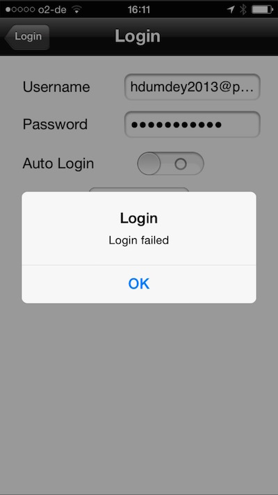

Hier meine kurze Geschichte: Vor zwei Jahren haben wir uns dazu entschieden eine Mini Photovoltaik Anlage zu installieren. Über Sinn und Zweck mag man streiten wenn man zu 100% den Strom selbst verbraucht, und keine Einspeisevergütung bekommt. Aber das ist ein anderes Thema. Fakt ist das wir so ein Ding haben und ich eigentlich sehr zufrieden bin.

Auf der Suche nach geeigneten PV-Modulen und den entsprechenden Umrichter, bin ich auf kleine Micro-Inverter gestossen. Das Konzept hat mich überzeugt, der Preis war in Ordnung.

<!-- more -->
## Was hat dies alles mit der Cloud zu tun?

Um zu ermitteln wie viel Strom wir erzeugen, habe ich einen eigenen Stromzähler eingebaut, aber auch ein sog. Gateway installiert.
Das Gateway sammelt die Daten von den beiden Invertern ein und schickt diese in die Cloud. Auch hier kann man darüber streiten ob man das möchte. Ein Thema das ich vielleicht später noch einmal aufgreifen möchte.

Fakt ist das man über die Webseite und einer App auf dem Handy eine wunderbare Auswertung bekommen hat. Was ist also das Problem?

Nun, der Hersteller der Inverter ist mittlerweile insolvent und somit habe ich auch keinen Zugriff mehr auf dieses Webportal. Ich stehe, wie einige andere auch, nun vor der Frage: Was tun? Mein eigener Zähler hat den erzeugten Strom mit erfasst, aber die schöne Auswertung ist nun dahin. An die Daten die in der Cloud liegen, komme ich natürlich auch nicht mehr. **Diese Daten sind wohl für immer verloren!**

## Was lerne ich daraus?

Kleine Firmen, auch große, können vom Markt verschwinden. Und man sollte sich im Vorfeld Gedanken machen, wen man seine Daten anvertraut. Und, gibt es eine Möglichkeit die Daten aus der Cloud zu bekommen. Hier sollten sich auch Firmen, die Cloud Dienste nutzen, einen Plan B bereit halten.

## Fazit

Die beiden Inverter laufen wunderbar weiter. Garantie Ansprüche werde ich im Fehlerfall nicht mehr geltend machen können. Und das Gateway ist ein Fall für den Mülleimer. An die 200,- € hat es gekostet. Für das Geld hätte ich mir auch eine Lösung bauen können die ich zuhause gehabt hätte. Die 200,- € müssen nun während der Laufzeit erwirtschaftet werden. Und ich werde mir überlegen ob ich mit einem RaspberryPi eine eigene Lösung baue. Was zusätzliches Geld kostet. Nach wie vor bin ich der Meinung das wir mit der Mini-PV Anlage Geld sparen können, solange die Inverter mitmachen.
Der Vorteil war eigentlich bestechend. Kein Setup, schöne Auswertung. Zurücklehnen und konsumieren. Solange es funktioniert.

Überlegt euch welche Daten in der Cloud liegen und was kann man tun wenn es die Cloud nicht mehr gibt!
