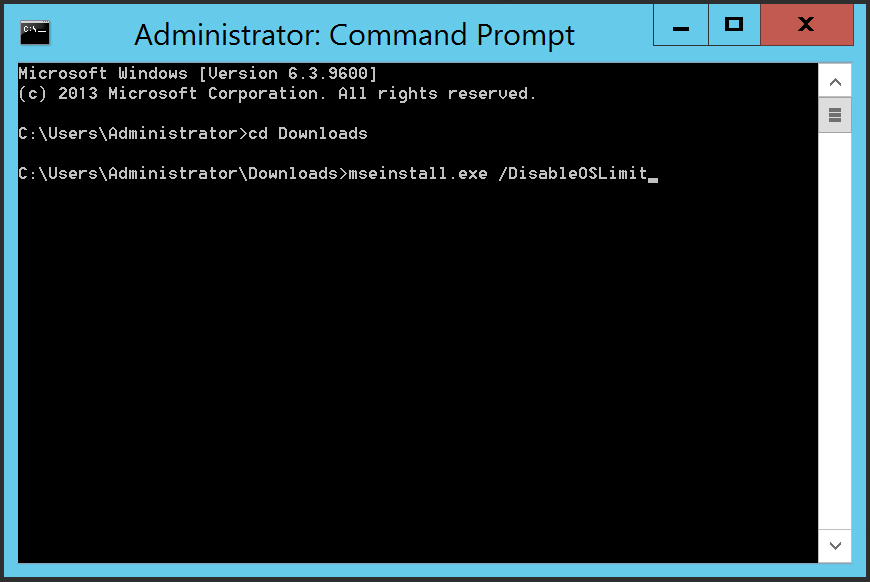
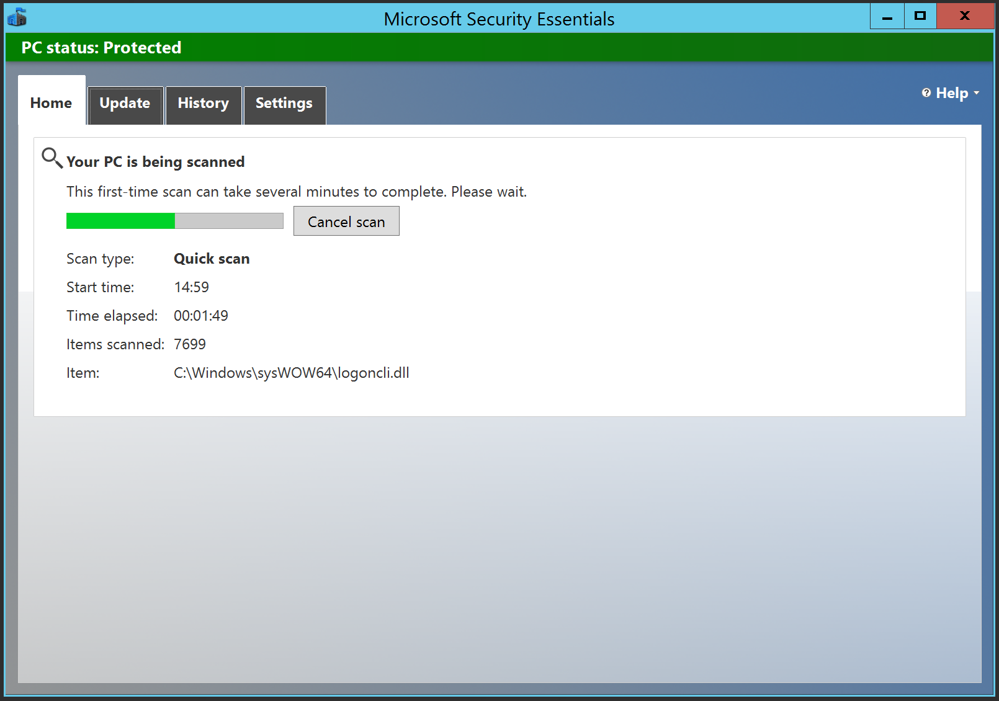

Manchmal möchte man nur mal schnell eine VM mit Windows Server 2012 installieren. Allerdings bleibt dann immer das ungute Gefühl mit dem fehlenden Virenscanner. Es gibt [ClamAV](http://www.clamwin.com), aber es gibt noch eine andere Möglichkeit.
Microsoft bietet die [Security Essentials](https://www.microsoft.com/en-us/download/details.aspx?id=5201) kostenlos zum Download an, allerdings nur für Desktop Systeme (Windows Vista, 7, 8 usw.)
Versucht man eine Installation unter einem der Microsoft Server Betriebssysteme, bricht diese ab...

Man kann allerdings Windows 2012 überreden.

<!-- more -->

* [Download von mseinstall.exe](https://www.microsoft.com/en-us/download/details.aspx?id=5201)

* Compatibility Mode von mseinstall.exe auf 'Windows 7' stellen

* Starten der Installation mit `mseinstall.exe /DisableOSLimit`

* Update und Scan
  Nach der Installation wie üblich die 'Virus und Spyware Definitionen' updaten und den Scan durchlaufen lassen

Natürlich kann ich keine Gewähr geben das dies immer so funktioniert, aber es ist doch eine schöne Alternative zu ClamAV oder einer teuren Server Edition von $AV-Produkt.
