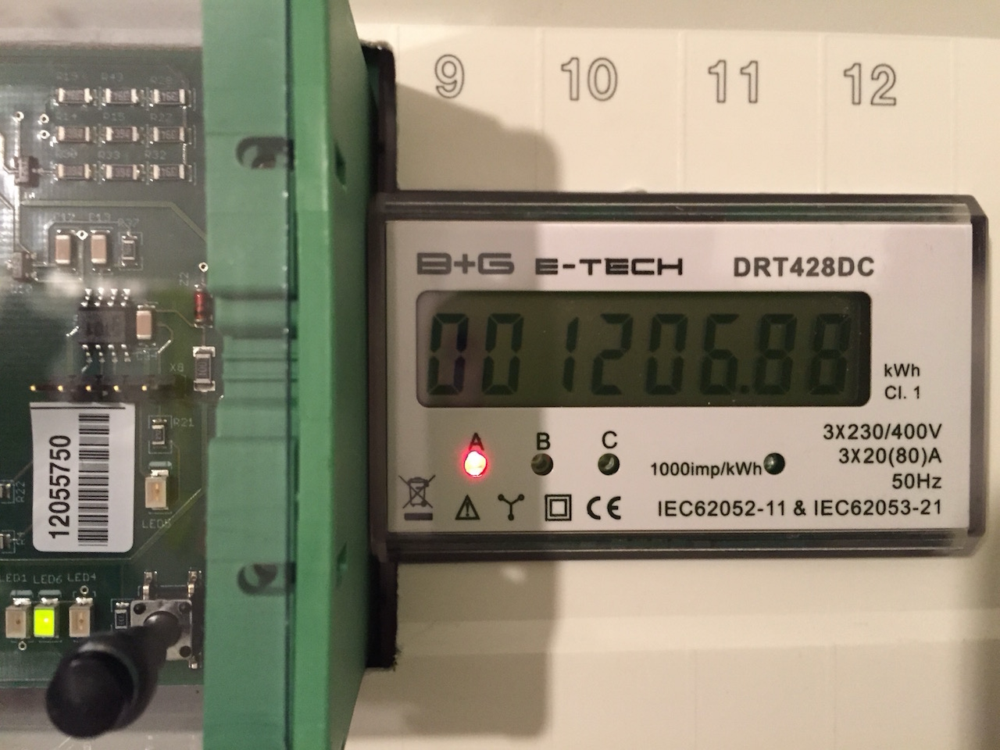
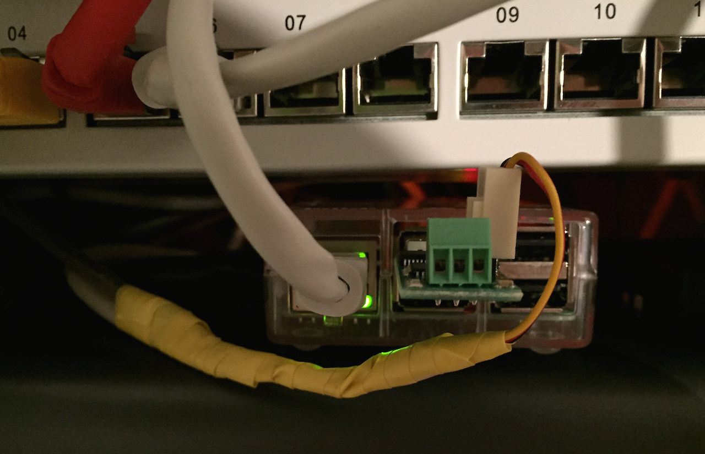
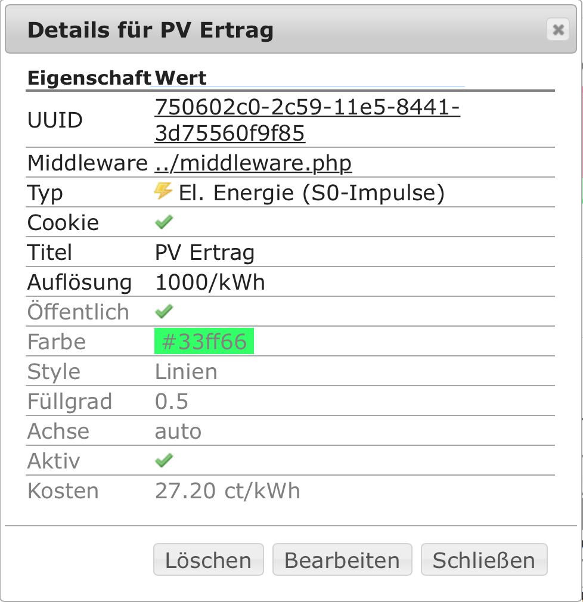
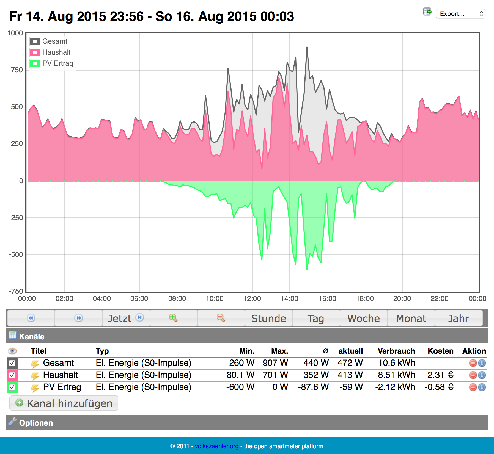
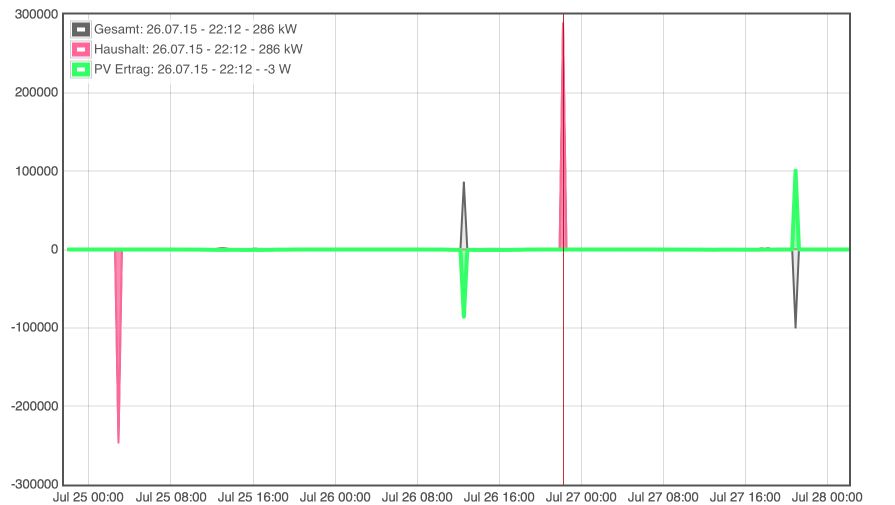

## Smart-Meter für eine mini Photovoltaik Anlage

Vor längerer Zeit habe ich geschrieben das ich eine Mini Photovoltaik Anlage habe. Der Anbieter, der den Stromgewinn in 'der Cloud' ausgewertet hat, ist ja leider insolvent. Seitdem habe ich nur die Werte von dem Extra Stromzähler den ich bereits von Anfang an eingebaut hatte. Hier ist der Link zu dem [Blogpost](https://pixelchrome.org/blog/cloud-dienste-fur-private-anwender/).
Ich hatte ja schon angedeutet das ich die grafische Auswertung selbst in die Hand nehmen werde. Nun ja, nicht ganz selbst...

Aber der Reihe nach...

<!-- more -->

## Hardware

### Computer

Als Computer wollte ich einen Raspberry Pi einsetzen. Der ist günstig in der Anschaffung und im Stromverbrauch, ausserdem gibt es viel Software die darauf läuft. Also wurde es ein [Raspberry Pi 2 Model B](https://www.raspberrypi.org/products/raspberry-pi-2-model-b/).


### Stromzähler

Der Stromzähler den ich einsetze um den Gewinn von der PV-Anlage zu messen ist ein **B+G E-Tech DRT428DC**. Er hat eine S0-Schnittstelle und damit prima geeignet. Heute würde ich allerdings einen DRT428DC-V2 nehmen. Der hat eine Rücklaufsperre.



### S0 Impulszähler USB

Nun ist es ja so das die Software irgendwie an die S0 Impulse kommen muss. Dazu gibt es wohl mehrere Möglichkeiten. Die einfachste mit einer seriellen Schnittstelle (RS232) hat bei mir einfach nicht geklappt.
Also musste spezielle Hardware her. Ich habe mich aufgrund der raschen Verfügbarkeit für **1wire-USB-Master** von [SMS-Guard](http://www.sms-guard.org/downloads/1wire-USB-Master/index.htm) entschieden.

## Software

Es gibt ein Smart Meter Projekt mit dem Namen [Volkszaehler](http://www.volkszaehler.org). Dies Software erschien mir als das richtige für mein Vorhaben.

## Setup

Eine Verbindung vom Stromzähler zu dem 1wire-USB-Master war schnell hergestellt.



### Probleme mit den Werten

Mit den eingebauten Funktionen der Volkszaehler-Software, war es mir aber nicht möglich vernünftige Werte zu bekommen.
Deshalb habe ich mein eigenes Skript geschrieben, welches die Daten überträgt. Voraussetzung ist die Software von SMS-Guard. Der Download ist [hier](http://www.sms-guard.org/downloads/1wire-USB-pi.tar) zu finden.

### Setup 1wire-USB

Im Skript `1wire-USB-rrd-sh` muss folgendes angepasst werden

```sh
######################### nur hier sind die eigenen Daten einzutragen
PROG_PATH="/home/pi/1wire"  # Pfad in dem die 1wire-USB läuft
DATA_PATH="/tmp"            # Pad zu den Daten in einer RAM-Disk tmpfs (/etc/fstab)
SERIAL="/dev/ttyUSB0"       # serielles Interface des 1wire-USB-Master-Adapters
```

Mithilfe von Cron muss die Software alle 5 Minuten gestartet werden.
```sh
*/5 * * * *          /home/pi/1wire/1wire-USB-rrd-sh
```

Im Verzeichnis `/tmp` werden nun die Dateien `L1v.txt` und `L2v.txt` erzeugt und die Werte entsprechen aktualisiert.

### Setup 1wire-USB-vz.sh

Das Skript welches nun die Daten entsprechend auswertet und an die Volkszähler Software weiter gibt heisst **1wire-USB-vz.sh** und ich habe es auf [GitHub](https://github.com/pixelchrome/1wire-USB-vz) gestellt.

Anpassungen sind folgende vorzunehmen

```sh
############## Settings #################
PROG_PATH="/home/pi/1wire"	# Directory of 1wire-USB
DATA_PATH="/tmp" #
#UUID_S0_1=aaaaaaaa-bbbb-cccc-dddd-eeeeeeeeeeee

#UUID_S0_1 Power Meter Photovoltaik -> Gain
UUID_S0_1=750602c0-2c59-11e5-8441-3d75560f9f85

#UUID_S0_2 Power Meter House -> Consumption
UUID_S0_2=8a2fc2f0-2c52-11e5-8451-27b03dfe6eb8

#UUID_SUM Consumption (Consumption + Photovoltaik)
UUID_SUM=83d96f20-2c59-11e5-b0bd-b1217f8f51d7

LIMIT_PV=25 #Limiting PV at 1500W, be aware, this is for 1-Minute CRON Interval!!! -> showing previous value
LIMIT_HOUSE=1000  #Limiting House PM at 60kW, be aware, this is for 1-Minute CRON Interval!!!-> showing previous value
############# Settings End #############
```

#### Infos 1wire-USB-vz.sh

Was bedeuten all die ganzen Werte?

Volkszaehler arbeitet mit [UUIDs](https://de.wikipedia.org/wiki/Universally_Unique_Identifier) für die einzelnen Messkanäle.

UUID_S0_1 - Ist in meinem Fall die S0 Schnittstelle des Photovoltaik Stromzählers
UUID_S0_2 - Ich nutze den zweiten S0 Eingang um unseren Stromzähler auszulesen
UUID_SUM - Ist einfach die Summe von beiden

Zu den Limits komme ich gleich noch.

Die UUIDs kommen aus dem Volkszaehler Web Frontend.
`Kanal hinzufügen -> Kanal erstellen -> Infos entsprechend anpassen`



Die UUID ist oben ersichtlich wenn man den Kanal auswählt und sich die Infos anzeigen lässt.

### Starten von 1wire-USB-vz.sh

Auch hierzu wird ganz simpel wieder Cron genutzt. Je nachdem wie detailliert man die Messwerte dargestellt haben möchte, muss die crontab entsprechend angepasst werden. Bei mir ist es ein einminütiges Intervall.

```sh
* * * * *	     /home/pi/1wire-USB-vz.sh
```

## Ausgabe

Wenn alles passt sieht es dann so aus



## Was ist mit den Limits?

Ich habe beobachtet das von Zeit zu Zeit sehr heftige Spikes in den Grafiken von volkszaehler zu erkennen waren. Woher die kommen ist mir unklar. Auf dem Bild ist zu erkennen das diese im 100kW Bereich liegen und damit definitiv nichts mit der Realität zu tun haben. Deshalb habe ich in das Skript einen Mechanismus eingebaut und diese Spikes zu begradigen. Daher ist es wichtig sinnvolle Werte einzutragen.


