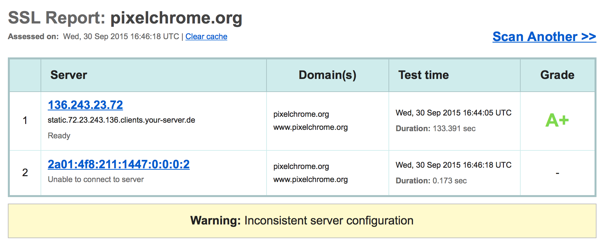

## SSL Labs Test

Ich habe heute festgestellt das mein Webserver nur ein '**A**' beim [SSL Labs Test](https://www.ssllabs.com/ssltest/) bekommen hat. Das musste natürlich auf ein A+ verbessert werden.

<!-- more -->

## NGINX Anpassung

Keine große Sache. Was fehlte war die [HTTP Strict Transport Security (HSTS)](https://en.wikipedia.org/wiki/HTTP_Strict_Transport_Security) Unterstützung.

Das sind die zusätzlichen Optionen die gesetzt werden müssen.
```
    ## HSTS
    add_header Strict-Transport-Security max-age=31536000;
    add_header X-Frame-Options DENY;
```
Und siehe da. Der Webserver bekam das erhoffte '**A+**'



### Inconsistent Server Configuration

Doch es kam auch eine Warnung. '*Warning: Inconsistent server configuration*'. Der Grund hierfür war leicht ersichtlich. **Auf IPv6-Adresse war der Server nicht zu erreichen!**

## IPv6 Configuration

Also, schnell gegoogelt und siehe da, die `listen` Variable muss angepasst werden.


Was allerdings nicht ganz stimmt. Denn nur ein `listen [::]:80;` bzw. `listen [::]:443;` lässt NGINX nur noch die IPv6 Adresse horchen.

```
netstat -an |grep -i listen|grep 80
tcp6       0      0 *.80                   *.*                    LISTEN
```

Was nicht in der Anleitung steht, seit NGINX Version 1.3.4, ist der `ipv6only` parameter auf '**on**'! Siehe [Changelog](http://nginx.org/en/CHANGES).

### Richtige Config für IPv4 UND IPv6
Somit muss also folgendes konfiguriert sein
```
listen       [::]:80 ipv6only=off;
```
Bzw.
```
listen       [::]:443 ssl spdy ipv6only=off;
```

Und siehe da, der Server antwortet sowohl auf der IPv4-Adresse als auch auf der IPv6-Adresse!


## Und so sieht das 'A+ Zertifikat' aus


