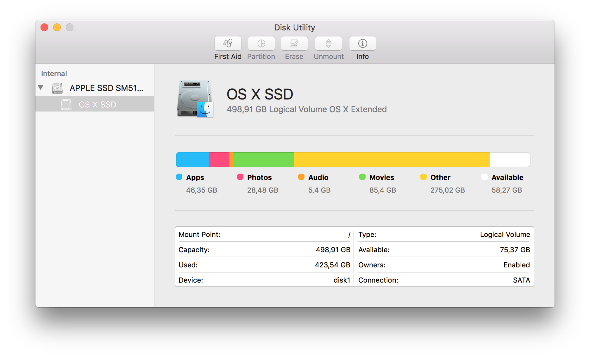

Mit der Veröffentlichung von OS X 10.11 (El Capitan) fehlt im Festplattendienstprogramm das 'Knöpfchen' zum überprüfen und reparieren der Zugriffsrechte ([siehe Support-Artikel von Apple](https://support.apple.com/de-de/HT201560)).

Falls man dies dennoch möchte, muss man das Terminal bemühen.

Überprüfen der Zugriffsrechte

`sudo /usr/libexec/repair_packages --verify --standard-pkgs --volume /`

Reparieren der Zugriffsrechte

`sudo /usr/libexec/repair_packages --repair --standard-pkgs --volume /`

