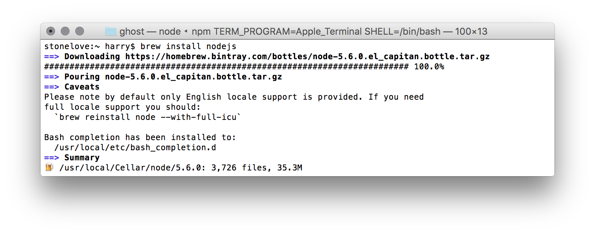
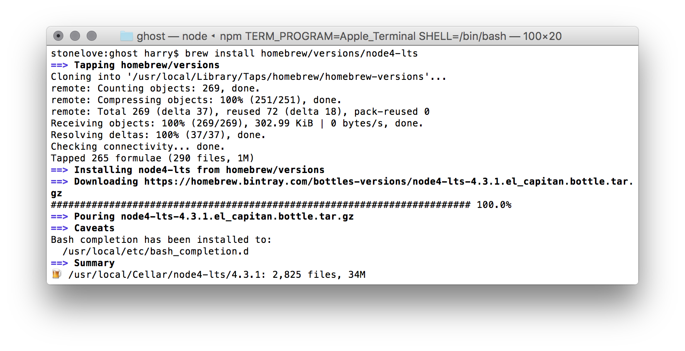
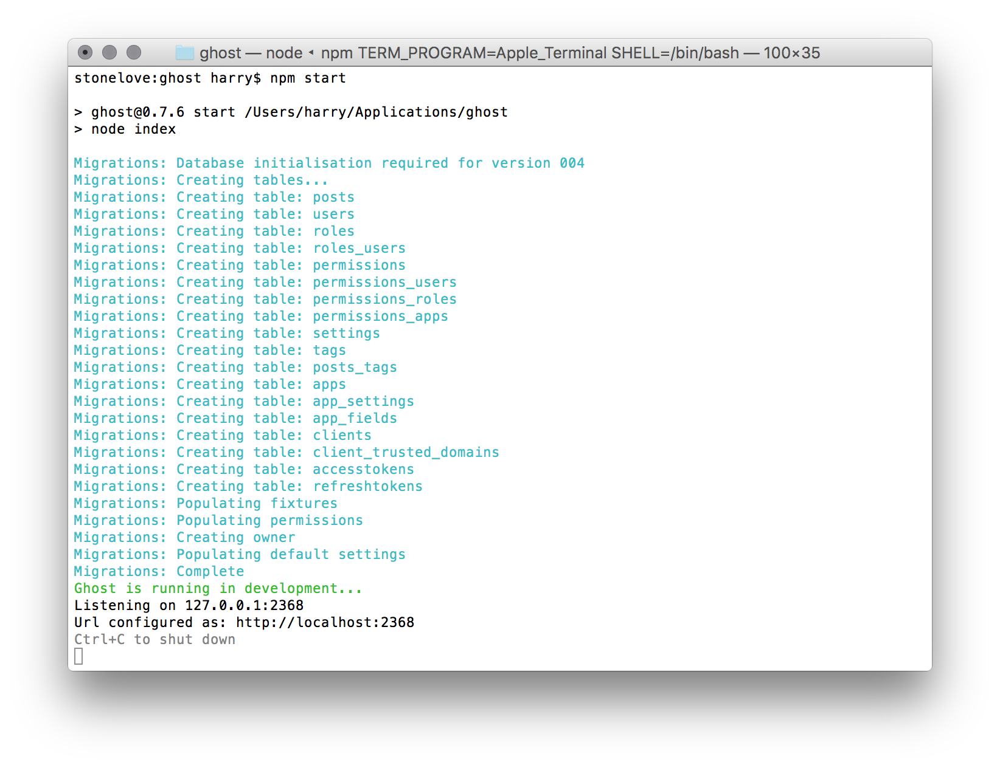

## Wie installiere ich Ghost unter Mac OS X?

## Ganz einfach! Oder?

> Mit brew nodejs installieren und dann mit `npm install` & `npm start` starten.

Im Prinzip ja, aber... wenn man nodejs neu installieren muss, dann wird ein `brew install nodejs` die neueste Version installieren. Die ist aber leider nicht supportet von [Ghost](http://support.ghost.org/supported-node-versions/).

<!-- more -->



Also dann eben die LTS Version von nodejs installieren? `brew install homebrew/versions/node4-lts`


Die Version ist leider auch zu neu :( . Zumindest für Ghost 0.7.6.



## Wie funktioniert es dann?

Doch wieder auf die bewährte 0.12.x Version zurückgreifen.
```sh
$ brew install homebrew/versions/node012
```

Ghost entpacken und mit `npm start` starten.


