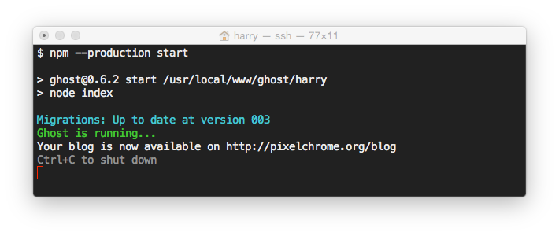

Ich benutze auf meinem Server FreeBSD und als Bogging-Software [Ghost](http://ghost.org). Hier ein paar Infos wie man das ans laufen bekommt. Mittlerweile geht das recht schmerzfrei :-)

<!-- more -->

## Installieren von Node.js und NPM
```
$ sudo portmaster www/node010 www/npm
$ node -v
v0.10.40
$ npm -v
2.14.7
```

## Erstellen des Users

```
$ sudo adduser
Username: ghost
Full name: Ghost Blog User
Uid (Leave empty for default):
Login group [ghost]: www
Login group is www. Invite ghost into other groups? []:
Login class [default]:
Shell (sh csh tcsh bash rbash zsh rzsh git-shell nologin) [sh]:
Home directory [/home/ghost]: /usr/local/www/ghost
Home directory permissions (Leave empty for default):
Use password-based authentication? [yes]: no
Lock out the account after creation? [no]: no
Username   : ghost
Password   : <disabled>
Full Name  : Ghost Blog User
Uid        : 1002
Class      :
Groups     : www
Home       : /usr/local/www/ghost
Home Mode  :
Shell      : /bin/sh
Locked     : no
OK? (yes/no): y
adduser: INFO: Successfully added (ghost) to the user database.
Add another user? (yes/no): no
Goodbye!
```

## Erstellen des Unterverzeichnisses und entpacken

```
$ su - ghost
$ pwd
/usr/local/www/ghost
$ mkdir blog
$ cd blog
$ unzip /tmp/ghost-0.6.2.zip
```

## Installieren

```
$ CXX=c++ npm install sqlite3 --sqlite=/usr/local
$ npm install --production --sqlite=/usr/local
```

## Anpassen der config.js Datei

Ich habe den URL und die Maileinstellungen angepasst

```
        url: 'http://pixelchrome.org/blog',
        mail: {
                transport: 'SMTP',
                options: {
                        host: '127.0.0.1',
                        service: '23mail'
                }
        },
```

## Ghost manuell starten
```
$ npm start --production
```



## NGINX Konfiguration
Ghost läuft bei mir in einem Unterverzeichnis und nicht in einer eigenen Domain oder Sub Domain. Auch hier gibt es eine schöne [Anleitung](https://www.allaboutghost.com/how-to-install-ghost-in-a-subdirectory/) von [allaboutghost.com](http://allaboutghost.com)
```
location ^~ /blog {
        proxy_set_header X-Real-IP $remote_addr;
        proxy_set_header X-Forwarded-For $proxy_add_x_forwarded_for;
        proxy_set_header Host $http_host;
        proxy_set_header X-NginX-Proxy true;

        proxy_pass http://127.0.0.1:2368;
        proxy_redirect off;
   }
```

## Startup Service
Um Ghost als Service unter FreeBSD laufen zu lassen, habe ich mich an die [Anleitung](https://jakobgillich.com/ghost-on-freebsd/) von Jakob Gillich gehalten.

## Links

* https://github.com/TryGhost/Ghost/wiki/HOWTO:FreeBSD
* https://www.allaboutghost.com/how-to-install-ghost-in-a-subdirectory/
* https://jakobgillich.com/ghost-on-freebsd/
