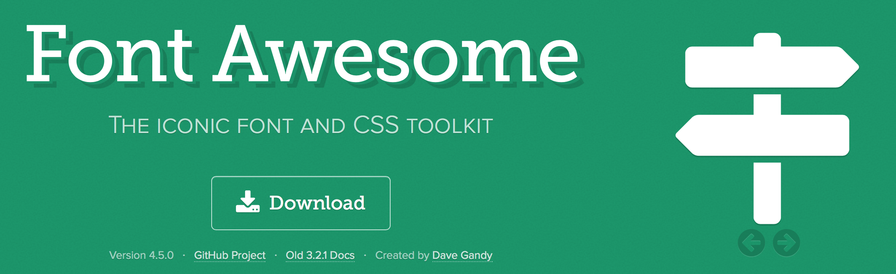
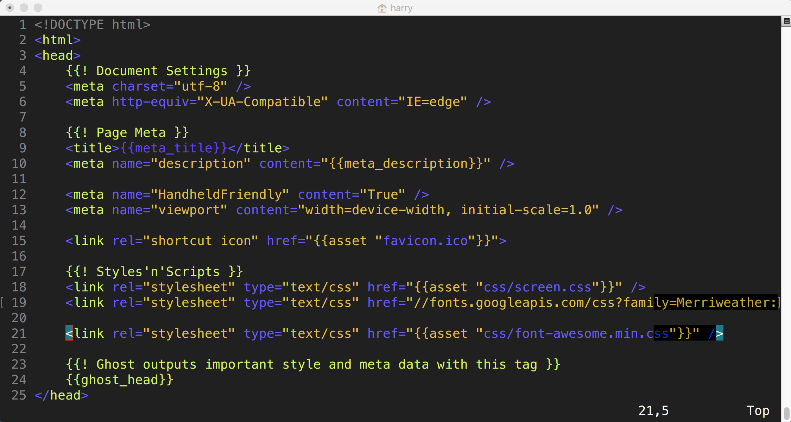

Ich liebe die Icons von [Font Awesome](http://fontawesome.io)! Und natürlich gibt es die Möglichkeit die auch in das Casper-Theme Ghost einzubinden.

Also das ist zu tun das es funktioniert:
<!-- more -->
## Download und Entpacken

Download von der gezippten Fonts von der [Webseite](http://fortawesome.github.io/Font-Awesome/). Irgendwo entpacken `unzip font-awesome-4.5.0.zip`

## CSS und Fonts kopieren

Die Datei `font-awesome.min.css` in das css Verzeichnis der Ghost Installation kopieren

```sh
cp font-awesome-4.5.0/css/font-awesome.min.css $GHOST_HOME/content/themes/casper/assets/css
```

Alle Dateien aus `font-awesome-4.5.0/fonts/` in das fonts Verzeichnis kopieren

```sh
cp font-awesome-4.5.0/fonts/* $GHOST_HOME/content/themes/casper/assets/fonts
```

## Anpassen von default.hbs

Im Abschnitt `{{! Styles'n'Scripts }}` von `$GHOST_HOME/content/themes/casper/default.hbs` folgendes ergänzen:

```sh
<link rel="stylesheet" type="text/css" href="{{asset "css/font-awesome.min.css"}}" />
```

Der Abschnitt sieht dann aktuell so bei meiner Installation aus:

```sh
    {{! Styles'n'Scripts }}
    <link rel="stylesheet" type="text/css" href="{{asset "css/screen.css"}}" />
    <link rel="stylesheet" type="text/css" href="//fonts.googleapis.com/css?family=Merriweather:300,700,700italic,300italic|Open+Sans:700,400" />

    <link rel="stylesheet" type="text/css" href="{{asset "css/font-awesome.min.css"}}" />
```



## Neustarten von Ghost

Danach muss Ghost neu gestartet werden.

## Nutzen der Icons

Einfach mit z.B. `<i class="fa fa-smile-o"></i>` <i class="fa fa-smile-o"></i>

## Links

* http://tmadhavan.com/adding-font-awesome-icons-to-ghost/
