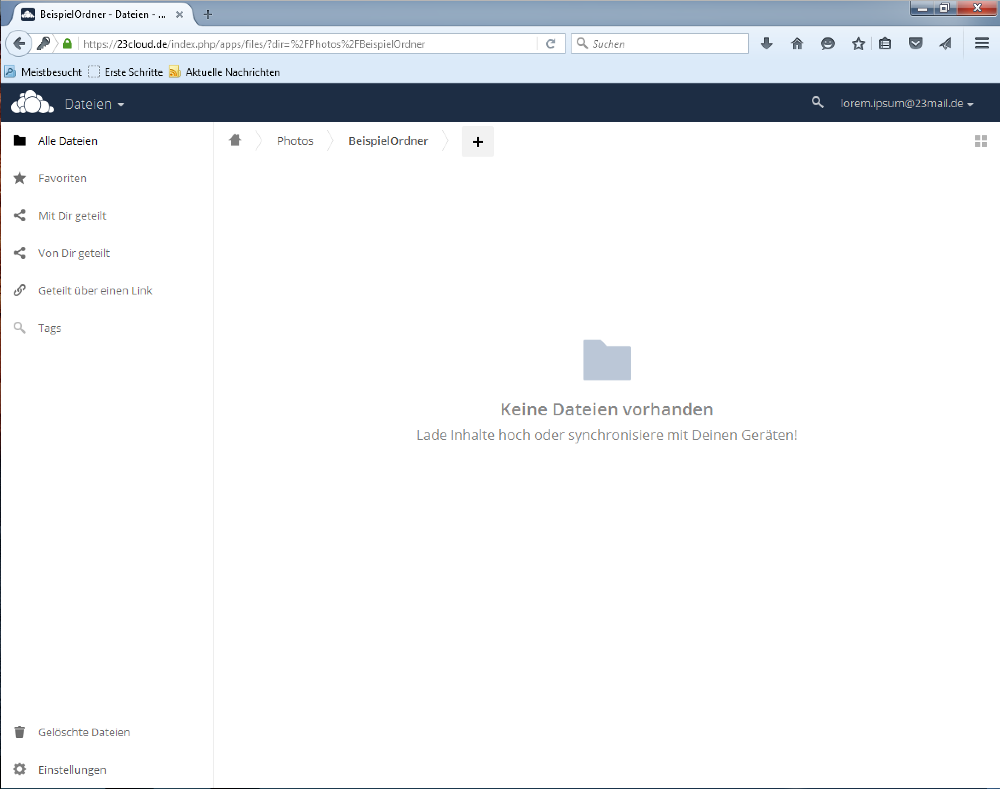

Dieser Beitrag ist für die Nutzer von 23cloud. Hier wird in ein paar einfachen Schritten gezeigt wie man Bilder mit anderen teilen kann. Auf Wunsch auch mit Passwort.
<!-- more -->

### 1. Schritt - Einloggen

### 2. Schritt - App installieren
Wie man die App nutzt kommt in einem späteren Beitrag. Also, schliessen mit dem X in der oberen rechten Ecke.

### 3. Schritt - Ordner erstellen
Auf das + Klicken und einen Namen eingeben.

### 4. Bilder hochladen
Wieder auf das + klicken und 'hochladen' auswählen. Es können auch mehrere ausgewählt werden.

### 5. In die 'Galerie' Ansicht wechseln

Links oben, neben dem 'owncloud' Symbol auf Galerie Ansicht wechseln.

### 6. Ordner auswählen

'BeispielOrdner' auswählen.

### 7. Link teilen

Rechts oben ist das 'teilen' Symbol <i class="fa fa-share-alt"></i>, 'Link teilen' und ggf. ein Passwort eingeben. Den Link dann kopieren und entsprechend verteilen.

