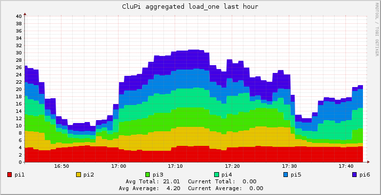

## Masternode

```sh
# sudo apt-get install ganglia-monitor ganglia-webfrontend
# sudo cp /etc/ganglia-webfrontend/apache.conf /etc/apache2/sites-enabled/ganglia.conf
```

<!-- more -->

### Configuration Masternode

```sh
# sudo vi /etc/ganglia/gmetad.conf
```

Change `data_source`

```sh
data_source "CluPi" 60 localhost
```

```sh
# sudo vi /etc/ganglia/gmond.conf
```

```json
[...]
cluster {
  name = "CluPi" ## use the name from gmetad.conf
  owner = "unspecified"
  latlong = "unspecified"
  url = "unspecified"
}
[...]
```

```json
udp_send_channel {
  #mcast_join = 239.2.11.71
  host = 192.168.1.161
  port = 8649
  ttl = 1
}
```

```json
udp_recv_channel {
  #mcast_join = 239.2.11.71
  port = 8649
  #bind = 239.2.11.71
}
```

Restart the services

```sh
# sudo service ganglia-monitor restart
# sudo service gmetad restart
# sudo service apache2 restart
```

## Client Installation

```sh
# sudo apt-get install -y ganglia-monitor
```

### Client Configuration

```sh
# sudo vi /etc/ganglia/gmond.conf
```

```json
[...]
cluster {
  name = "CluPi"     ## Cluster name
  owner = "unspecified"
  latlong = "unspecified"
  url = "unspecified"
[...]
```

```json
[...]
udp_send_channel {
  #mcast_join = 239.2.11.71   ## Comment
  host = 1.1.1.1   ## IP address of master node
  port = 8649
  ttl = 1
}
[...]
```

Comment out the `udp_recv_channel` section with `/* ... */`

```json
[...]
/* You can specify as many udp_recv_channels as you like as well.
udp_recv_channel {
  mcast_join = 239.2.11.71
  port = 8649
  bind = 239.2.11.71
}
*/
[...]
```

Restart the monitoring service.

```sh
sudo service ganglia-monitor restart
```

### Links
- https://www.digitalocean.com/community/tutorials/introduction-to-ganglia-on-ubuntu-14-04
