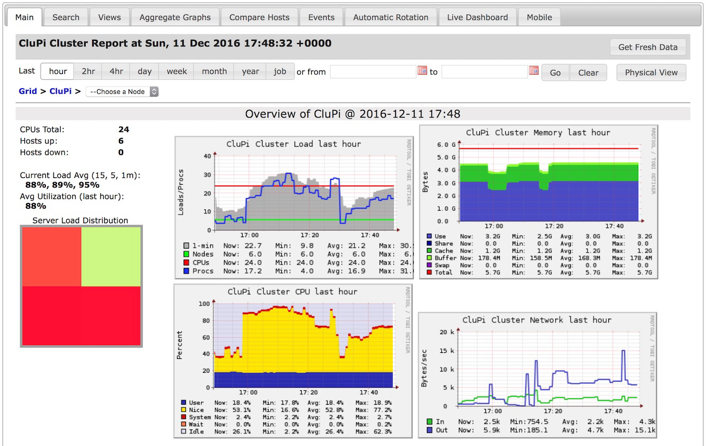

## Ich habe ein neues Spielzeug :-)


Das ist ein 6-Node Raspberry Pi. Ich habe vor damit verschiedene Sachen auszuprobieren. Z.B. [Minio](https://minio.io) ([distributed](https://docs.minio.io/docs/distributed-minio-quickstart-guide)), [GlusterFS](https://www.gluster.org), [Docker](https://www.docker.com) ([Docker Swarm](https://www.docker.com/products/docker-swarm)), [OpenStack](https://www.openstack.org), Load-Balancing Tests, usw.

<!-- more -->

## Einstein@Home

Im Moment läuft zum 'einbrennen' gerade [Einstein@Home](https://einsteinathome.org) auf dem Cluster.


## CPU-Temperatur

Die Temperatur der einzelnen Raspi's kann man per Command-Line abfragen. Dafür gibt es das Kommando `vcgencmd measure_temp`. Um das alle zwei Sekunden auszugeben, dann eben mit:

```
# watch -n 2 vcgencmd measure_temp
```

Das sieht dann z.B. so aus:

```
Every 2.0s: vcgencmd measure_temp           Sun Dec 11 20:00:49 2016

temp=67.7'C
```

## Ganglia

Zunächst mal habe ich [Ganglia](http://ganglia.info) installiert, um einen Überblick zu bekommen was die einzelnen Nodes so machen. Ein [Quickstart-Installation-Guide](https://pixelchrome.org/blog/quickstart-guide-how-to-install-ganglia-on-a-raspberry-pi-cluster/) habe ich gerade eben auf diesem Blog veröffentlicht.



## Ganglia CPU-Temperatur

Ganglia kann alle möglichen Infos mit dem *Ganglia Metric Tool* (gmetric) erfassen. Mit der obigen Commandline ist das dann relativ schnell zusammengebastelt. Ich hab das auf [GitHub](https://github.com/pixelchrome/gmetric-rpi-temp) gestellt. Für die einzelnen Nodes findet man die Temperatur dann unter 'no_group metrics'.


Außerdem lässt sich mit 'Aggregate Graphs' eine Übersicht bauen


## More to come...

Das war schon mal ein ganz netter Einstieg. Mal sehen was noch kommt. Stay tuned...
