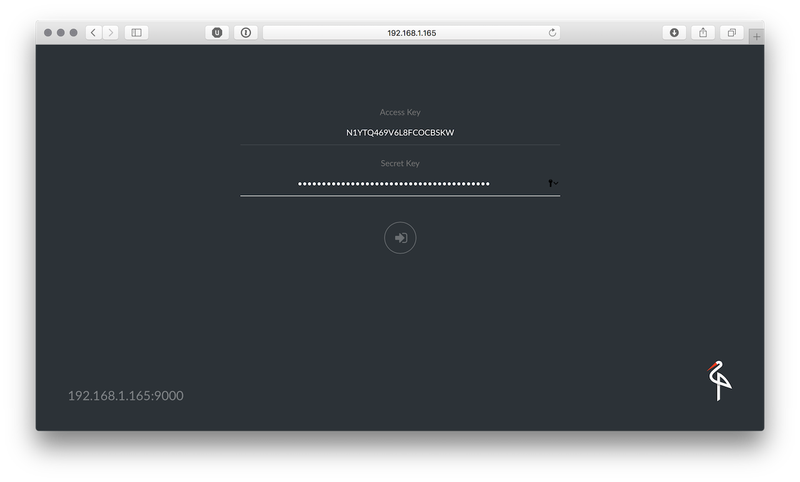
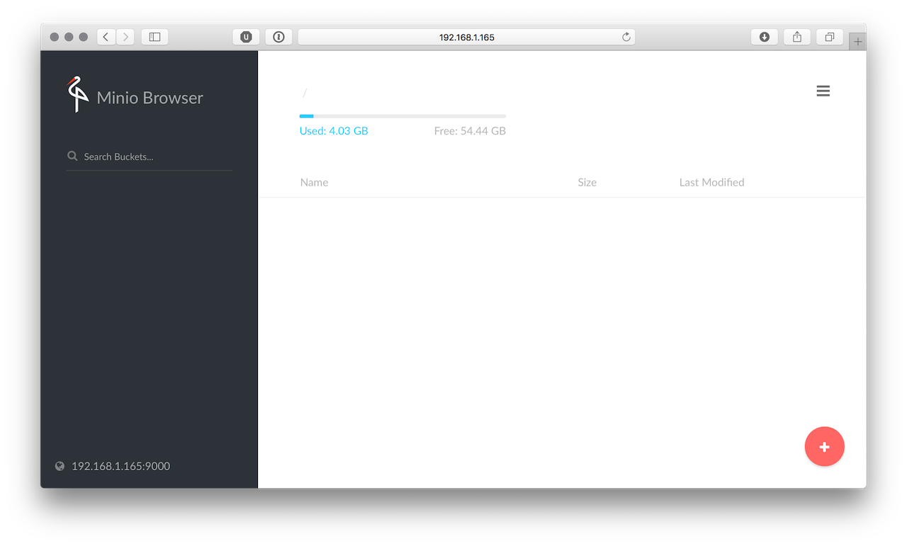

## Was ist Minio?

[Minio](https://minio.io) ist ein Object Storage Server für Entwickler oder kleine Umgebungen.

## Und auf dem Raspberry?

Auf der Quickstart Seite von Minio ist beschrieben wie man den Docker Container startet. Auf dem Raspberry funktioniert das natürlich nicht (weil der Container nicht für die ARM-Platform gebaut ist)

Deshalb habe ich ein Dockerfile für den Raspberry gebaut. Die Quellen sind wie immer auf [GitHub](https://github.com/pixelchrome/minio-arm) und auf Docker Hub ist ein Image zu finden.
<!-- more -->
## Beispiel

```sh
$ sudo docker pull pixelchrome/minio-arm
Using default tag: latest
latest: Pulling from pixelchrome/minio-arm
441134fbd8aa: Pull complete
26d03b3cca93: Pull complete
c9dab664b787: Pull complete
Digest: sha256:7f45b451407a188fa02d997165afe778ee2d3658820a59fd666c1b8d7d526681
Status: Downloaded newer image for pixelchrome/minio-arm:latest
```

```sh
sudo docker run -p 9000:9000 -v /export/minio -v /export/mino-config:/root/.minio pixelchrome/minio-arm server /export

Endpoint:  http://172.17.0.2:9000  http://127.0.0.1:9000
AccessKey: N1YTQ469V6L8FCOCBSKW
SecretKey: qzYXJbGY249C9W/L5AywGqhjEp0wCD+sd6Itp+ke
Region:    us-east-1
SQS ARNs:  <none>

Browser Access:
   http://172.17.0.2:9000  http://127.0.0.1:9000

Command-line Access: https://docs.minio.io/docs/minio-client-quickstart-guide
   $ mc config host add myminio http://172.17.0.2:9000 N1YTQ469V6L8FCOCBSKW qzYXJbGY249C9W/L5AywGqhjEp0wCD+sd6Itp+ke

Object API (Amazon S3 compatible):
   Go:         https://docs.minio.io/docs/golang-client-quickstart-guide
   Java:       https://docs.minio.io/docs/java-client-quickstart-guide
   Python:     https://docs.minio.io/docs/python-client-quickstart-guide
   JavaScript: https://docs.minio.io/docs/javascript-client-quickstart-guide

Drive Capacity: 54 GiB Free, 58 GiB Total
```

Funktioniert :-)




