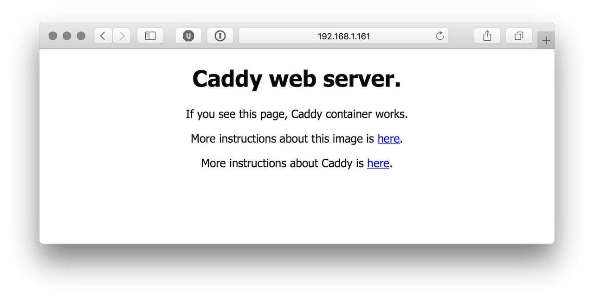

## What is Caddy?

From the [website](https://caddyserver.com)

> Caddy is an alternative web server that is easy to configure and use.

and

> **A web server that serves you**
Other web servers were designed for the Web, but Caddy was designed for humans, with today's Web in mind.

This wonderful piece of software is a perfect fit for my 6-Node Cluster of Raspberries!


<!-- more -->
### Here is an example:

Caddy is super easy to install and to configure. See this [video](https://www.youtube.com/watch?v=nk4EWHvvZtI) how to setup caddy running HTTPS and get automatically a valid certificate from [Let's encrypt](https://letsencrypt.org).

## Back to my idea

But back to the basics and see how to create a docker service. I want to run caddy as a [docker service](https://docs.docker.com/engine/swarm/services/). To install docker, please see my [Quickstart-Installation guide](https://pixelchrome.org/blog/quickstart-guide-how-to-install-docker-a-raspberry-pi/).

### What is a Docker service?

> Frequently a service will be the image for a microservice within the context of some larger application.

What?!

> To deploy an application image when Docker Engine is in swarm mode, you create a service.

Ok, docker needs to run in swarm mode... see the [Quickstart Docker Swarm](https://pixelchrome.org/blog/quickstart-docker-swarm/)

## Lets get started

### We need a docker image
Based on [abiosoft/caddy-docker](https://github.com/abiosoft/caddy-docker) I've created a dockerfile for the Raspberry Pi which can be found on [GitHub](https://github.com/pixelchrome/caddy-arm) and [Dockerhub](https://hub.docker.com/r/pixelchrome/caddy-arm/)

### Create a docker service

```sh
$ docker service create --name caddy-service --publish 2015:2015 --replicas 6 pixelchrome/caddy-arm
m4xs9p90h2jj12xs07zur8vtp
```

#### Check

```sh
$ docker service ls
ID            NAME           MODE        REPLICAS  IMAGE
m4xs9p90h2jj  caddy-service  replicated  1/6       pixelchrome/caddy-arm:latest
```

```sh
$ docker service ps caddy-service
ID            NAME             IMAGE                         NODE  DESIRED STATE  CURRENT STATE               ERROR  PORTS
ej0njtn4dkl0  caddy-service.1  pixelchrome/caddy-arm:latest  pi3   Running        Running 2 minutes ago
n33ikkyy9ygr  caddy-service.2  pixelchrome/caddy-arm:latest  pi6   Running        Running about a minute ago
h0rwye2zbk2j  caddy-service.3  pixelchrome/caddy-arm:latest  pi5   Running        Running about a minute ago
k4wal0jegcag  caddy-service.4  pixelchrome/caddy-arm:latest  pi2   Running        Running 2 minutes ago
ie91uryxhxwq  caddy-service.5  pixelchrome/caddy-arm:latest  pi1   Running        Running 2 minutes ago
s8bas4humy84  caddy-service.6  pixelchrome/caddy-arm:latest  pi4   Running        Running about a minute ago
```

On each Raspberry Pi is one instance of caddy running!



### Remove the service

```sh
$ docker service rm caddy-service
caddy-service
```

```sh
$ docker service ls
ID  NAME  MODE  REPLICAS  IMAGE
```

### Customize

If you need more specific settings you can change the `Caddyfile` or you want to host more than just the default `index.html` file, please find some examples below. These files or directory have to be available on each node of the swarm!

#### Mount a specific "Document Root" (e.g. /var/www of the Raspian)

```
$ docker service create --name caddy-service --publish 2015:2015 --replicas 6 --mount type=bind,source=/var/www,target=/srv pixelchrome/caddy-arm
```

#### A specific `Caddyfile`

```sh
$ docker service create --name caddy-service --publish 2015:2015 --replicas 6 --mount type=bind,source=<PATH>/Caddyfile,target=/etc/Caddyfile pixelchrome/caddy-arm
```

#### A combination of both examples from above

```sh
$ docker service create --name caddy-service --publish 2015:2015 --replicas 6 --mount type=bind,source=/home/pi/example/Caddyfile,target=/etc/Caddyfile --mount type=bind,source=/var/www,target=/srv pixelchrome/caddy-arm
```

## Next article

Caddy runs now independently on each node of the swarm. It is time to put a load balancer in front of it. Stay tuned...

## Links

* [Caddy Server](https://caddyserver.com)
* [Swarm mode key concepts](https://docs.docker.com/engine/swarm/key-concepts/)
