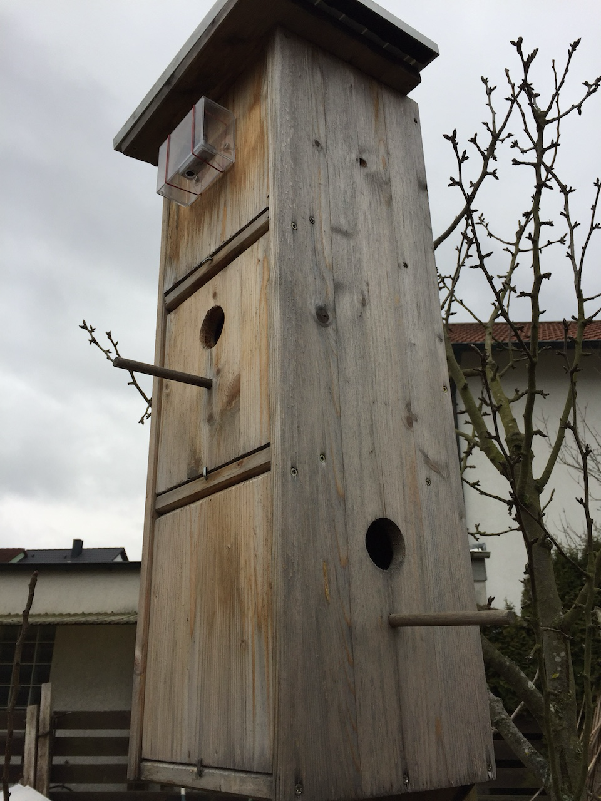
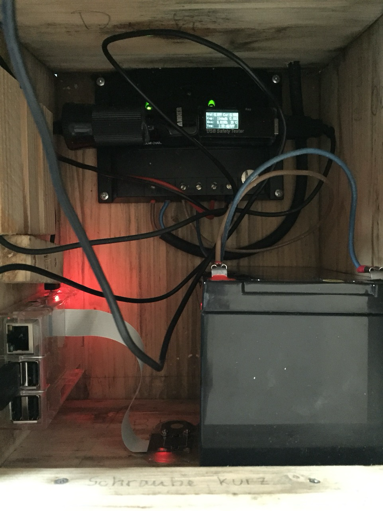
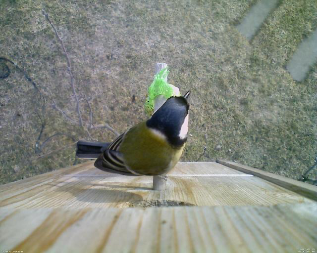
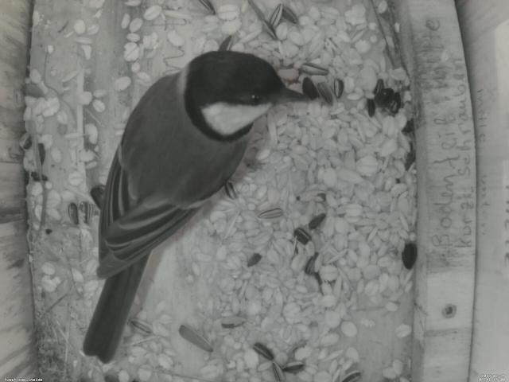

Letztes Jahr hat mein Sohn mit seinem Opa, dieses dreistöckige Vogelhaus gebaut.



Dieses Jahr haben wir es etwas aufgerüstet ;-)

## Der Umbau

Die obere 'Wohnung' wurde nun in einen Technikraum umgenutzt. Hier sind nun ein Solar-Power-Converter, ein 12V-Akku und ein Raspberry Pi zu finden. An dem Raspberry haben wir eine alte  USB-Kamera und eine [Raspberry Kamera mit mit IR-LEDs](https://www.amazon.de/Kuman-Raspberry-Kamera-nachtsichttaugliches-Modelle/dp/B01ICNT3HC/ref=sr_1_2?ie=UTF8&qid=1488116625&sr=8-2&keywords=raspberry+kamera) angeschlossen.

<!-- more -->



Auf dem Dach ist ein kleines PV-Modul angebracht worden um den Akku zu laden.
Die Raspberry-Kamera ist von uns so angebracht worden, dass man nun den darunter liegenden Teil des Nistkastens sehen kann.
Außen wurde die USB-Kamera angebracht. Natürlich einigermaßen wetterfest. Den einen oder anderen Regen hat sie schon problemlos überstanden. Mal sehen wie lange die durchhält.

## Software

Als Software wird [Motion](http://www.lavrsen.dk/foswiki/bin/view/Motion/WebHome) ([die neue Webseite](https://motion-project.github.io)) benutzt. Out-of-the-box funktioniert Motion mit einer Kamera ganz prima. Will man aber zwei (oder mehrere) verwenden, muss man die Kameras einzeln konfigurieren. Neben der `/etc/motion/motion.conf`, gibt es noch `/etc/motion/thread1.conf` & `/etc/motion/thread2.conf`. Hier können die unterschiedlichen Konfiguration pro Kamera vorgenommen werden.

Mit Motion kann man ein Live-Bild sehen und zusätzlich werden, wenn Bewegungen auf dem Bild zu erkennen sind, Bilder erzeugt.
Diese Bilder werden per RAM-Disk zwischengespeichert und alle 5 Minuten per NFS auf einen anderen Server übertragen.

### Störungen

Leider hat die USB-Kamera einen leichten 'Knacks' und es sind regelmässig Störungen erkennbar. Die werden auch als Bewegungen erkannt, und die Platte wird vollgemüllt. Wenn ich eine günstige und passende USB-Kamera finde, wird sie ausgetauscht.

## Strom sparen

Da der Raspberry mit den beiden Kameras (und den IR-LEDs) recht ordentlich Strom zieht, ist der Akku nach einem Tag leer. Deshalb haben wir noch eine Zusatzplatine in Verwendung. Mit [Witty Pi2 von UUGEAR](http://www.uugear.com/product/wittypi2/) kann ein kompletter Shutdown, inklusive Trennung vom Strom durchgeführt werden. Und noch viel wichtiger... das kleine Platinchen kann den Raspberry auch noch aufwecken. Bisher hat das ganz gut funktioniert.

### Witty Pi Konfiguration

Es ist wirklich sehr einfach Witty Pi zu konfigurieren. Es wird ein Skript aufgerufen mit dem man die Einstellungen vornehmen kann.

```sh
pi@tweety:~ $ sudo wittyPi/wittyPi.sh
================================================================================
|                                                                              |
|   Witty Pi 2 - Realtime Clock + Power Management for Raspberry Pi            |
|                                                                              |
|                   < Version 2.53 >     by UUGear s.r.o.                      |
|                                                                              |
================================================================================
>>> Current temperature: 28.25°C / 82.85°F
>>> Your system time is: Sun 26 Feb 2017 14:24:59 CET
>>> Your RTC time is:    Sun 26 Feb 2017 14:24:59 CET
Now you can:
  1. Write system time to RTC
  2. Write RTC time to system
  3. Synchronize time
  4. Schedule next shutdown [?? 20:00:00]
  5. Schedule next startup  [?? 06:30:00]
  6. Choose schedule script
  7. Reset data...
  8. Exit
What do you want to do? (1~8) 8
```

### Erste Tests

Da noch keine Brutzeit ist, habe ich einen Meisenknödel an das Stängchen gehängt. Und ein bisschen Futter liegt im Haus. Ein paar Meisen waren schon da :-)





## Tweetycam Live

~~[Hier gibt es die Livebilder zu sehen](https://pixelchrome.org/blog/tweetycam-live/). Mal schauen was der Raspberry so leisten kann.

## Fortsetzung folgt...
Work in Progress :-)

## Links
- https://kamera-im-vogelhaus.de/
- http://www.nistkasten-webcam.de/
- http://www.piepmatz-cam.de/
