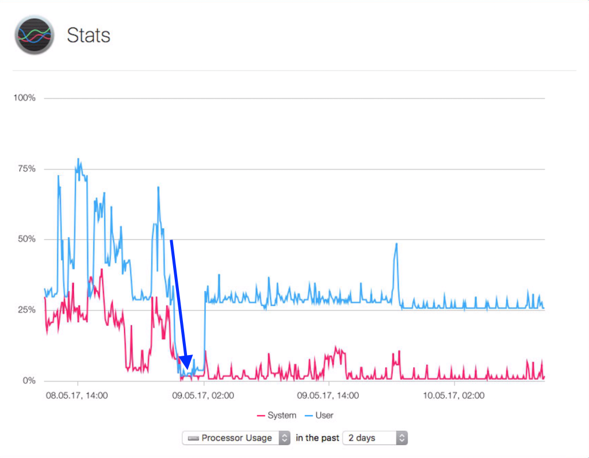

I had a really high load on my Mac Mini Server. As it is a Late 2014 with only two CPU-Cores, everything hurts which makes the Server slow.

Two processes consumed a lot of Memory and CPU-Time.

```sh
apspd & cfprefsd
```

<!-- more -->

With `fs_usage` I've found out that `cfprefsd reads and writes all the time to `/Library/Preferences/ApplePushServiceProvider/com.apple.apspd.plist`. And this file was more the 53 MByte! So it looked like `apspd` is the reason for the issue.

A `cat /Library/Preferences/ApplePushServiceProvider/com.apple.apspd.plist | strings | wc -l` showed a line count of more than 500k lines.

Something like this was the content of a line
```sh
H{"mdm":"A1BC2D3F-1A23-1A22-AB1C-A1234B1234567","time":"512161284.226341"}O
```

The plist file it self was OK
```sh
$ plutil /Library/Preferences/ApplePushServiceProvider/com.apple.apspd.plist
/Library/Preferences/ApplePushServiceProvider/com.apple.apspd.plist: OK
```

The Manual Page just explained that APSPD is the *ApplePushServiceProvider helper process*. I haven't found much more information about it which explains it in more detail.

```sh
apspd(8)                  BSD System Manager's Manual                 apspd(8)

NAME
     apspd -- ApplePushServiceProvider helper process

SYNOPSIS
     apspd

DESCRIPTION
     apspd is used by the ApplePushServiceProvider framework for various functions.

NOTE
     apspd should not be invoked directly.  It is intended only for use by the ApplePushServiceProvider framework.

Darwin                           May 10, 2017                           Darwin
```

To reduce the Load on my server, I did the following

1. MAKE A BACKUP!!!
2. Disable Push-Notifications in the Server-App `<SERVERNAME> -> Settings -> Notifications`
3. Stop the Device-Manager `# serveradmin stop devicemgr`
4. Remove the Push-Notifications for the Alerts `Alerts -> Delivery -> Push Notifications -> Edit Notification -> remove all recipients`
5. Force Quit `apspd`(via Activity Monitor)
6. Move (remove) the plist file `# sudo mv /Library/Preferences/ApplePushServiceProvider/com.apple.apspd.plist* /tmp`
7. Start the Device-Manager `# serveradmin start devicemgr`

In my case, the plist file had now a size of around 600 Bytes! CPU went down from 100% to 6%. After that I've enabled the Push Notifications and the Alerts.

See here a screenshot



The rise of the load at 2:00 can be ignored. That was a different issue ;-)

P.S.: After I've written this here, I've found a [discussion thread](https://discussions.apple.com/thread/6536842?start=0&tstart=0) with nearly the same outcome...
