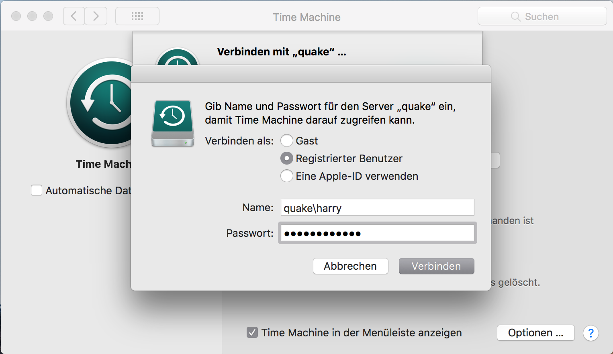

## Time Machine doesn't work on Network Shares after the upgrade

After I've updated my Mac Pro to macOS High Sierra, Time Machine Backups stopped working.

## Shared with SMB?

The backups are on a Mac Mini and I've found out that it is necessary to share the folder via SMB.

But that checkmark has already been set. Therefore I've tried to reconnect the Mac Pro to the Backup destination.

<!-- more -->

## OSStatus Error 17

And I've received Error 'OSStatus Error 17'. I wasn't able to find out a description what this means, but looks like that there is an authentication problem.

I used `Username` and `Password`. **That doesn't work here with SMB!**

## Fixed!

The solution is to use `Domain\Username` and `Password`. The Domain is simply the Servername in this case.

Time Machine is now working just like before...

