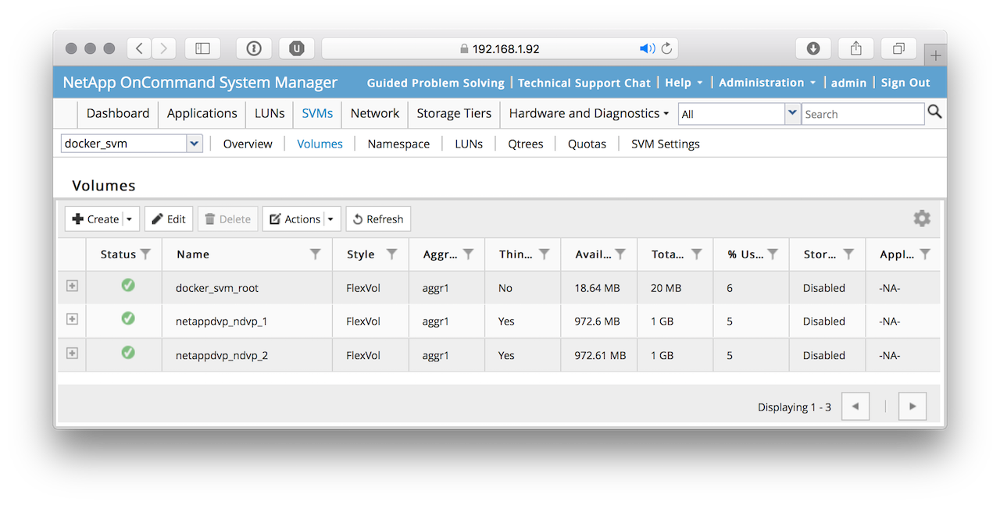

## TL;DR
NetApp provides a plugin for docker for x86 platforms. With a small modification it works perfectly well on a Raspberry Pi (ARM).

## Intro

A year ago I've written some articles about running docker on a cluster of Raspberry Pi.

NetApp published a [plugin for docker](https://github.com/NetApp/netappdvp) to integrate NetApp's SolidFire, ONTAP, and E-series storage platforms.

Of course this plugin is available for x86 (AMD64), but not for any other platform. Therefore I thought if it is possible to build this plugin for a Raspi (ARM).

<!-- more -->


## Why?

Because it works :-)
Raspberry Pi computers found their way into serious development. Here is one  [example](https://www.anandtech.com/show/12037/cheap-supercomputers-lanl-has-750node-raspberry-pi-development-clusters) at the [LANL](http://www.lanl.gov/discover/news-release-archive/2017/November/1113-raspberry-pi.php) and another [one](https://arxiv.org/pdf/1709.06815.pdf)


## Preparation

I've installed an ONTAP Simulator and prepared a SVM (NFS) for testing. Important is to assign an aggregate to this SVM.

```sh
cl1_ext::> vserver modify -vserver docker_svm -aggr-list aggr1

cl1_ext::> vserver show -fields aggr-list
vserver aggr-list
------- ---------
cl1_ext -
cl1_ext_1
        -
docker_svm
        aggr1
3 entries were displayed.
```


## Building the plugin

I've forked the original plugin on GitHub and did some small changes. You can find it [here](https://github.com/pixelchrome/netappdvp).

### Clone it from GitHub

```sh
pi@pi2:~/GitHub $ git clone https://github.com/pixelchrome/netappdvp.git

Cloning into 'netappdvp'...
remote: Counting objects: 1479, done.
remote: Compressing objects: 100% (3/3), done.
remote: Total 1479 (delta 0), reused 1 (delta 0), pack-reused 1476
Receiving objects: 100% (1479/1479), 5.36 MiB | 2.52 MiB/s, done.
Resolving deltas: 100% (993/993), done.
```

### `make`

This will take some time...

```sh
pi@pi2:~/GitHub $ cd netappdvp/
pi@pi2:~/GitHub/netappdvp $ make

Unable to find image 'golang:1.8' locally
1.8: Pulling from library/golang
95e140a16c79: Pull complete
237499cbbf2c: Pull complete
72f718f16c2f: Pull complete
52f8299ccc67: Pull complete
fb38ec71f61c: Pull complete
a8f0c65096e4: Pull complete
e8f0084080c2: Pull complete
Digest: sha256:cfacde49e420f25d80814de7b593c2156ab79ed624e8e0d707f01d89a55afdaf
Status: Downloaded newer image for golang:1.8
.....
```

### Installing

This is from the [documentation, chapter:  Traditional Install Method](http://netappdvp.readthedocs.io/en/latest/install/host_config.html#traditional-install-method-docker-1-12)

#### 1. Ensure you have Docker version 1.10 or above

```sh
pi@pi2:~/GitHub/netappdvp $  docker --version
Docker version 17.09.1-ce, build 19e2cf6
```

#### 2. This is different from the documentation! Copy the binary `netappdvp` to `/usr/local/bin`

```sh
pi@pi2:~/GitHub/netappdvp $ cd bin
pi@pi2:~/GitHub/netappdvp/bin $ sudo cp netappdvp /usr/local/bin
pi@pi2:~/GitHub/netappdvp/bin $ sudo chown root:root /usr/local/bin/netappdvp
pi@pi2:~/GitHub/netappdvp/bin $ sudo chmod 755 /usr/local/bin/netappdvp
```

#### 2.1 Configuration

Create the configuration file

```sh
sudo vi /etc/netappdvp/ontap-nas.json
```

```json
{
    "version": 1,
    "storageDriverName": "ontap-nas",
    "managementLIF": "192.168.1.93",
    "dataLIF": "192.168.1.93",
    "svm": "docker_svm",
    "username": "vsadmin",
    "password": "NetApp01234",
    "aggregate": "aggr1"
}
```

## Start

```sh
pi@pi2:~/GitHub/netappdvp $ sudo netappdvp --config=/etc/netappdvp/ontap-nas.json &

INFO[2017-12-29T13:18:36Z] Initialized logging.                          buildTime="Fri Dec 29 12:49:33 UTC 2017" driverBuild=17.10.0-custom+a12b7a846ac980092f951cb312d545d49e25b96f driverVersion=17.10.0-custom logFileLocation=/var/log/netappdvp/netapp.log logLevel=info
INFO[2017-12-29T13:18:36Z] Initializing storage driver                   mode=native port= storageDriver=ontap-nas version=17.10.0 volumeDriver=netapp
WARN[2017-12-29T13:18:36Z] Could not determine controller serial numbers. API status: failed, Reason: Unable to find API: system-node-get-iter, Code: 13005
INFO[2017-12-29T13:18:37Z] Initialized driver; plugin ready!
```

## Test

### Create a Volume

```sh
pi@pi2:~ $ docker volume create -d netapp --name ndvp_1
```

### Provision Docker volume when starting a container

```sh
pi@pi2:~ $ docker run --rm -it --volume-driver netapp --volume ndvp_2:/my_vol alpine ash
```
...
```sh
/ # df -h

Filesystem                Size      Used Available Use% Mounted on
/dev/mapper/docker-179:2-260301-56c9e6842c05d7a247216e766cea70472a7695974b6e65b7faea2ec671afa922
                          9.7G     26.6M      9.2G   0% /
tmpfs                    64.0M         0     64.0M   0% /dev
tmpfs                   488.4M         0    488.4M   0% /sys/fs/cgroup
192.168.1.93:/netappdvp_ndvp_2
                        972.8M    192.0K    972.6M   0% /my_vol
/dev/root                58.5G      3.9G     52.1G   7% /etc/resolv.conf
/dev/root                58.5G      3.9G     52.1G   7% /etc/hostname
/dev/root                58.5G      3.9G     52.1G   7% /etc/hosts
shm                      64.0M         0     64.0M   0% /dev/shm
tmpfs                    64.0M         0     64.0M   0% /proc/latency_stats
tmpfs                    64.0M         0     64.0M   0% /proc/timer_list
tmpfs                    64.0M         0     64.0M   0% /proc/timer_stats
tmpfs                    64.0M         0     64.0M   0% /proc/sched_debug
tmpfs                   488.4M         0    488.4M   0% /sys/firmware
```

### What happens on the SVM?

```sh
cl1_ext::> volume show -vserver docker_svm
Vserver   Volume       Aggregate    State      Type       Size  Available Used%
--------- ------------ ------------ ---------- ---- ---------- ---------- -----
docker_svm docker_svm_root aggr1    online     RW         20MB    18.64MB    6%
docker_svm netappdvp_ndvp_1 aggr1   online     RW          1GB    972.6MB    5%
docker_svm netappdvp_ndvp_2 aggr1   online     RW          1GB    972.6MB    5%
3 entries were displayed.
```



### Destroy docker volumes

```sh
pi@pi2:~ $ docker volume rm ndvp_1
ndvp_1
pi@pi2:~ $ docker volume rm ndvp_2
ndvp_2
```

```sh
cl1_ext::> volume show -vserver docker_svm
Vserver   Volume       Aggregate    State      Type       Size  Available Used%
--------- ------------ ------------ ---------- ---- ---------- ---------- -----
docker_svm docker_svm_root aggr1    online     RW         20MB    18.62MB    6%
```

## Links
* [A Docker volume plugin for NetApp storage](https://github.com/NetApp/netappdvp)
* [NetApp Docker Volume Plugin Documentation](http://netappdvp.readthedocs.io/en/latest/)
* [Bitscope Clusters](http://cluster.bitscope.com)
