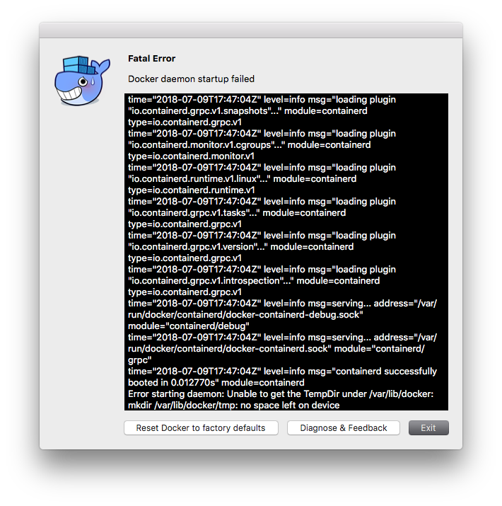
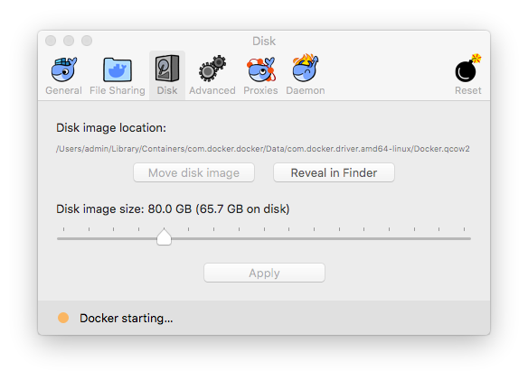
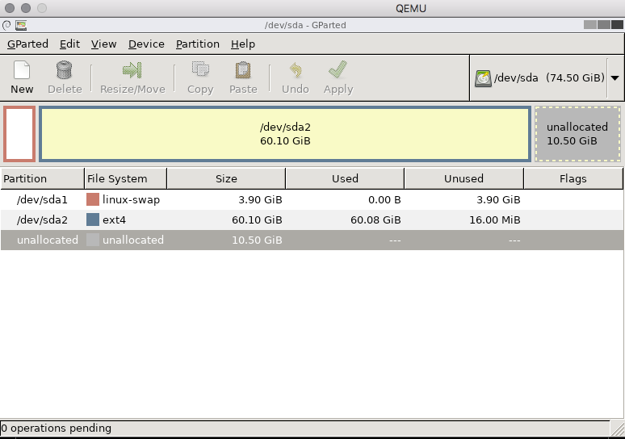
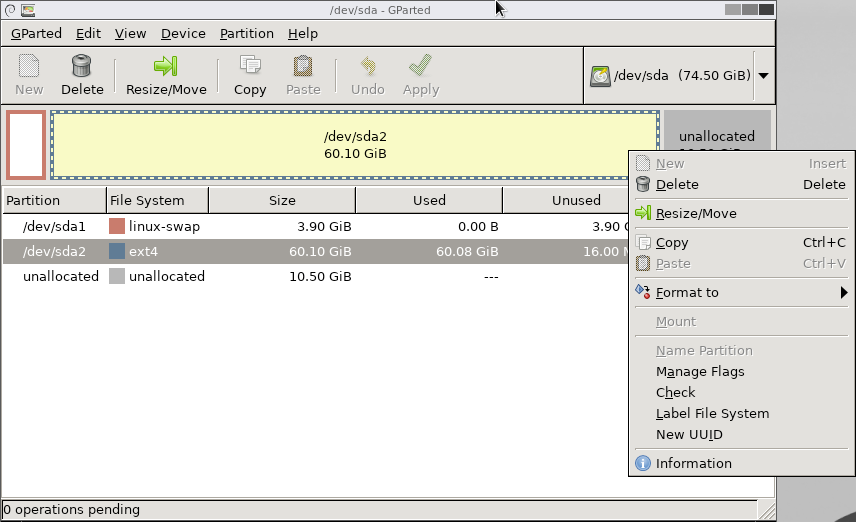
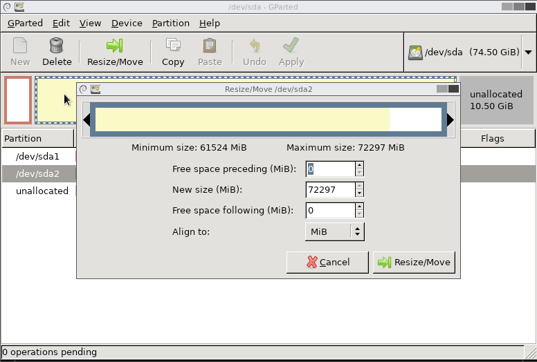
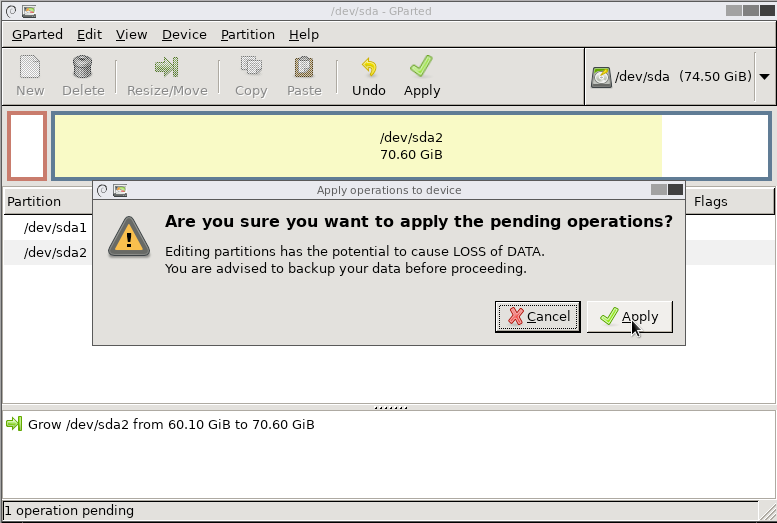
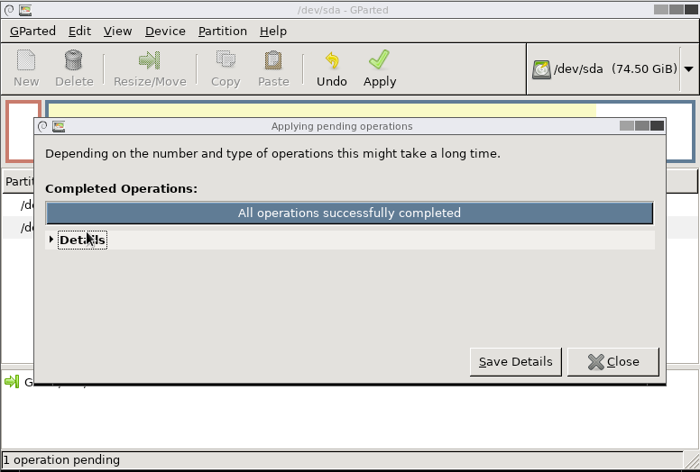

## Fatal Error

My Docker on macOS doesn't start anymore. It shows the following



At the very last line, you can see the following Error Message: `no space left on device`

<!-- more -->

## Disk full?
Of course there is enough space on my local drive available, but the **Docker disk image** [see FAQ](https://docs.docker.com/docker-for-mac/faqs/#disk-usage) is full.

The disk image is located here `~/Library/Containers/com.docker.docker/Data/com.docker.driver.amd64-linux/Docker.qcow2`

With the `qcow-tool` you can check it:

```shell
$ /Applications/Docker.app/Contents/MacOS/qcow-tool info Docker.qcow2
```
```
((version Three) (backing_file_offset 0) (backing_file_size 0)
 (cluster_bits 16) (size 68719476736) (crypt_method None) (l1_size 128)
 (l1_table_offset ((bytes 131072) (is_mutable false) (is_compressed false)))
 (refcount_table_offset
  ((bytes 65536) (is_mutable false) (is_compressed false)))
 (refcount_table_clusters 1) (nb_snapshots 0) (snapshots_offset 0)
 (additional
  (((dirty true) (corrupt false) (lazy_refcounts true) (autoclear_features 0)
    (refcount_order 4))))
 (extensions
  ((Feature_name_table
    (((ty Incompatible) (bit 0) (feature Dirty))
     ((ty Incompatible) (bit 1) (feature Corrupt))
     ((ty Compatible) (bit 0) (feature Lazy_refcounts)))))))
```

## Okay, looks good so far! Now how can I resize it?

I wasn't able to get it done with `qcow-tool resize`.

Therefore I tried the GUI



This helped only partially.

```sh
$ /Applications/Docker.app/Contents/MacOS/qcow-tool info Docker.qcow2
```
```
((version Three) (backing_file_offset 0) (backing_file_size 0)
 (cluster_bits 16) (size 79999008768) (crypt_method None) (l1_size 150)
 (l1_table_offset ((bytes 131072) (is_mutable false) (is_compressed false)))
 (refcount_table_offset
  ((bytes 65536) (is_mutable false) (is_compressed false)))
 (refcount_table_clusters 1) (nb_snapshots 0) (snapshots_offset 0)
 (additional
  (((dirty true) (corrupt false) (lazy_refcounts true) (autoclear_features 0)
    (refcount_order 4))))
 (extensions
  ((Feature_name_table
    (((ty Incompatible) (bit 0) (feature Dirty))
     ((ty Incompatible) (bit 1) (feature Corrupt))
     ((ty Compatible) (bit 0) (feature Lazy_refcounts)))))))
```
The size changed from 68719476736 to 79999008768, but the error is still the same.
Only the image size was changed, not the filesystem *inside* the image!

## Resize the Filesystem

1. Install [QEMU](https://www.qemu.org)
   `brew install qemu`
2. Check the size
   `qemu-img info Docker.qcow2
3. Download [gparted-livecd](http://gparted.org/download.php) http://gparted.org/download.php
4. Start gparted
   `$ qemu-system-x86_64 -drive file=Docker.qcow2 -m 512 -cdrom ~/Downloads/gparted-live-0.31.0-1-i686.iso -boot d -device usb-mouse -usb`

### Screenshots




See the unallocated diskspace. Choose 'Resize/Move'


Resize the FS


Apply


Done!

## Cleanup

Maybe I need cleanup docker more often :-D I have several unused Images and lots of volumes.

```sh
$ docker system prune -a --volumes
WARNING! This will remove:
        - all stopped containers
        - all networks not used by at least one container
        - all volumes not used by at least one container
        - all images without at least one container associated to them
        - all build cache
Are you sure you want to continue? [y/N] y
Deleted Containers:
a4b9806ee38e6d580a254e0b1222028a370871ff7229581ee37482f183b5e388
102b0202625200ce8b431d5805b85e44a3c74d825c7300129b22f36f3df278f9
5960e707837b9449b2f3a9923ea2d565893967e24207dd9cdd1b4ed6bf038546
...


Deleted Volumes:
05ad495fc7d561741583f7274a76542caa35be45bade0666d9ca1506aac8cb33
1727a9745c5790a1b4524222609c462922a31868a041fa9a9d126f087e505a5e
bb24a1bd60f2380dc0711da2ee3e9a7f7fbd7c0f12d7091906a704033b7c6e43
...

Deleted Images:
untagged: abiosoft/caddy:latest
untagged: abiosoft/caddy@sha256:bd2c4e17cf20f749f4ce1eb739cfb8a8f44e6d3740c1b16c573abb41b67f377e
deleted: sha256:52870bf7599892ef3ec5e275b559683ea3ad67e94c4ee03f8ed4f38f46957374
deleted: sha256:570f6d14f4c97d59e36b9fa7afd8fb028258236b9d851a7d20e91d1a476762ad
...

Total reclaimed space: 2.426GB
```

[This](https://docs.docker.com/docker-for-mac/faqs/#how-do-i-reduce-the-size-of-dockerqcow2) should also help. But I was not able to get run properly on macOS ([see also here](https://github.com/docker/for-mac/issues/371))

## Links
* [stefanfoulis/docker_for_mac_disk_default_size.md](https://gist.github.com/stefanfoulis/5bd226b25fa0d4baedc4803fc002829e#file-docker_for_mac_disk_resize-md)
* Credit for this procedure goes to the conversation in https://forums.docker.com/t/consistently-out-of-disk-space-in-docker-beta/9438/6. Especially to jgielstra.
