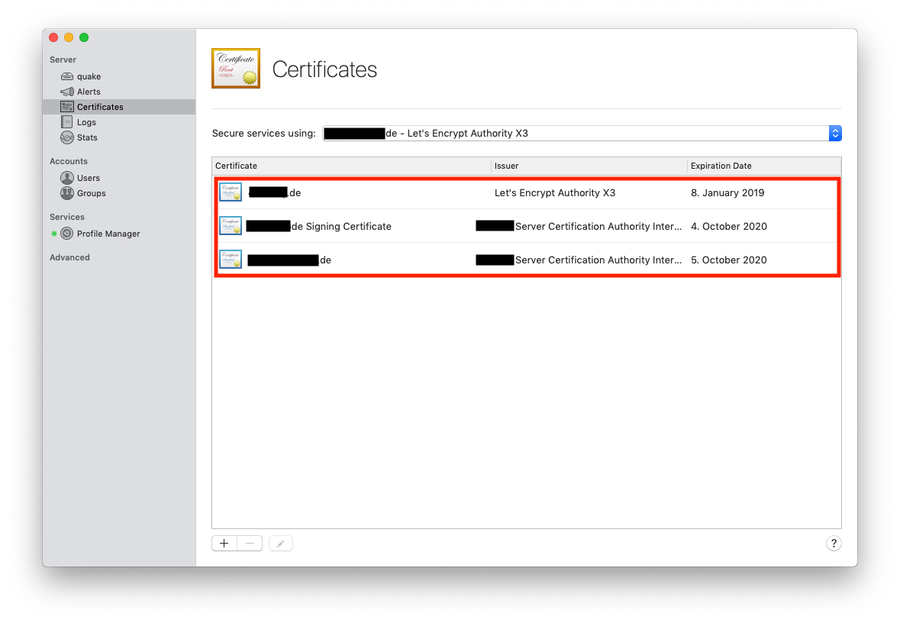
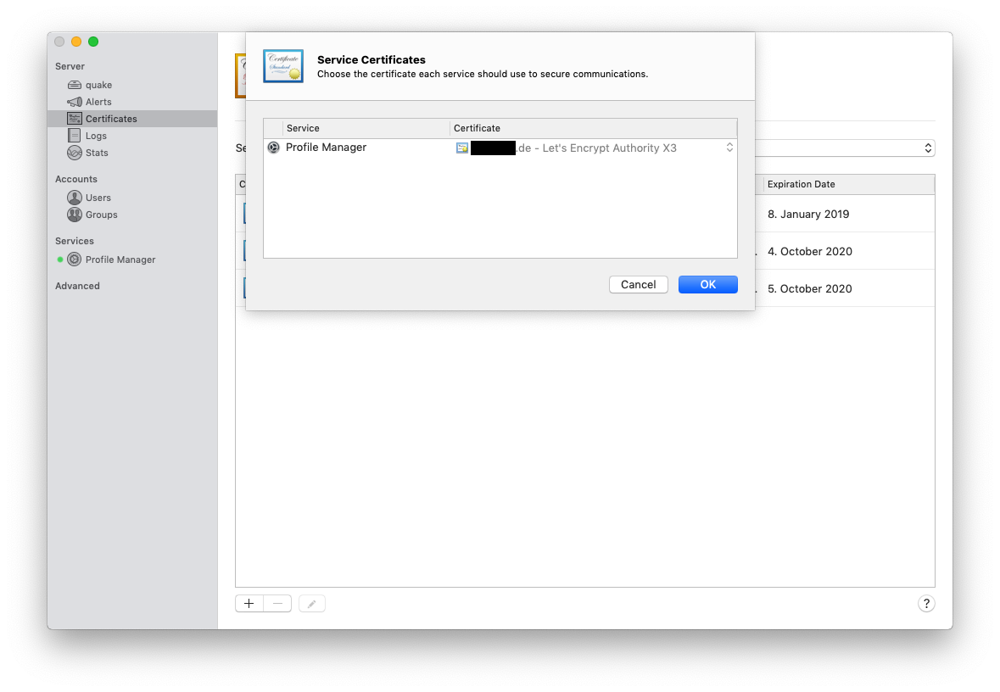

Even with all the [restrictions](https://support.apple.com/en-us/HT208312) of today some people need to run macOS Server (mojave 5.7.1).

With the availability of [letsencrypt](https://letsencrypt.org) it is possible to use this server with a proper signed certificate instead of a self-signed certficate. I am using cloudflare-dns. With some changes you can use this also for other methods.

This is a tutorial and scripts to install letsencrypt, get a certificate an renew it. Use it on your own risk!

<!-- more -->

See my [repository](https://github.com/pixelchrome/macoscertbot) for the latest updates.

Requirements:

* macOS Server (5.7.1)
* cloudflare-dns

## Install [brew](https://brew.sh)

```sh
$ /usr/bin/ruby -e "$(curl -fsSL https://raw.githubusercontent.com/Homebrew/install/master/install)"
```

## Install [certbot](https://certbot.eff.org)

```sh
$ brew install letsencrypt
```

## Install dns-cloudflare plugin

```sh
$ pip3 install certbot-dns-cloudflare
```

### Check certbot plugins

```sh
$ certbot plugins

- - - - - - - - - - - - - - - - - - - - - - - - - - - - - - - - - - - - - - - -
* dns-cloudflare
Description: Obtain certificates using a DNS TXT record (if you are using
Cloudflare for DNS).
Interfaces: IAuthenticator, IPlugin
Entry point: dns-cloudflare =
certbot_dns_cloudflare.dns_cloudflare:Authenticator

* standalone
Description: Spin up a temporary webserver
Interfaces: IAuthenticator, IPlugin
Entry point: standalone = certbot.plugins.standalone:Authenticator

* webroot
Description: Place files in webroot directory
Interfaces: IAuthenticator, IPlugin
Entry point: webroot = certbot.plugins.webroot:Authenticator
- - - - - - - - - - - - - - - - - - - - - - - - - - - - - - - - - - - - - - - -
```

## Clone this repository

```sh
$ git clone https://github.com/pixelchrome/macoscertbot.git
```

## Configuration

All configfiles are located in the `config` directory

### `cert.ini`

Basic settings for your certificate. Add here your **EMAIL** and the **domain(s)**.

```ini
# Use a 4096 bit RSA key instead of 2048
rsa-key-size = 4096
# Register with the specified e-mail address
email = <EMAIL>
# Generate certificates for the specified domains.
domains = <DOMAIN>
# Uncomment to use a text interface instead of ncurses
# text = True
# To use the webroot authenticator.
authenticator = dns-cloudflare
#webroot-path = WEB_ROOT_FOLDER
```

### `cloudflare.ini`

Cloudflare API credentials. Add here the **EMAIL** your are using for accessing cloudflare and add the **public API-Key**.

```ini
# Cloudflare API credentials used by Certbot
dns_cloudflare_email = <EMAIL>
dns_cloudflare_api_key = <PUBLIC_API_KEY>
```

### `macoscertbot.ini`

This is the configuration for the scripts used the get and renew a certificate. Change here the **DOMAINNAME** and the **USERNAME**

```ini
DOMAIN_DEFAULT="<DOMAINNAME>"
PEM_FOLDER="/etc/letsencrypt/live/${DOMAIN_DEFAULT}/"
BASE_FOLDER="/Users/<USERNAME>/letsencrypt"
CONFIG_FOLDER="${BASE_FOLDER}/config/"
LOG_FOLDER="${BASE_FOLDER}/logs"
DATE=$(date +"%d-%m-%y")
LOG_FILE="${LOG_FOLDER}/${DATE}.log
```

### Verify the file permissions of the ini-files.

These should be only readable for the owner.

```sh
$ ls -l config
total 24
-rw-------  1 harry  staff  360 10 Okt 21:16 cert.ini
-rw-------  1 harry  staff  164 10 Okt 09:49 cloudflare.ini
-rw-------  1 harry  staff  257 10 Okt 21:15 macoscertbot.ini
```

## Running `get_cert.sh` the first time

I've added the `--dry-run` option to all scripts.

Here is the example:
```sh
$ ./get_cert.sh
Saving debug log to /var/log/letsencrypt/letsencrypt.log
Plugins selected: Authenticator dns-cloudflare, Installer None
Cert not due for renewal, but simulating renewal for dry run
Renewing an existing certificate
Performing the following challenges:
dns-01 challenge for 47.dmdy.de
dns-01 challenge for 47.dmdy.de
Waiting 10 seconds for DNS changes to propagate
Waiting for verification...
Cleaning up challenges


IMPORTANT NOTES:
 - The dry run was successful.
```

If everything is OK you should remove the `--dry-run` option!

The `get_cert.sh` will run after a successful retrival of the certificate the `keychain_import.sh`. This adds the certificate to the Server Keychain.

## Server App

Open the *Server App* and go to *Server* > *Certificates*

You should see here these certificates
* *self-signed certificate* (Issuer *... Server Certification Authority Intermediate CA*)
* *code-signing certificate* (Issuer *... Server Certification Authority Intermediate CA*) - optional
* *letsencrypt certificate*  (Issuer *Let's Encrypt Authority X3*)



To use this certificate:

Go to *Secure services using* > select *Custom...* > and select for the *Profile Manager* the **Letsencrypt certificate**




Now you need to restart the *Profile Manager*

## Renew

Here is also added the `--dry-run` option. You should remove it after you verified that everything works fine.

**For production remove the  `--force-renew` option**

## Todo

Automation of the *renew* is currently not in this description

## Links

* https://certbot-dns-cloudflare.readthedocs.io/en/latest/
* https://bjornjohansen.no/wildcard-certificate-letsencrypt-cloudflare
* https://community.letsencrypt.org/t/complete-guide-to-install-ssl-certificate-on-your-os-x-server-hosted-website/15005/2
