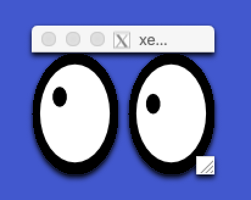

# macOS and the X Window System

If you want to use the [X Window System](https://www.x.org/) on macOS, you need [XQuartz](https://www.xquartz.org).
<!-- more -->
## Install XQuartz

```sh
brew cask install xquartz
```

After a Reboot you will get the `$DISPLAY` set correctly.

## Test with `xeyes`

```sh
/opt/X11/bin/xeyes
```



## SSH X11Forwarding

You can now use `ssh -X` or `ssh -Y`

## Uninstall

```sh
brew cask uninstall xquartz
```

## Start XQuartz temprorary

This is only necessary if you want to start XQuartz without a reboot.

```sh
launchctl load /Library/LaunchAgents/org.macosforge.xquartz.startx.plist
launchctl start org.macosforge.xquartz.startx
```

## Set DISPLAY

### find the socket

Note the time when you started xquartz

```sh
ls -l /private/tmp
total 0
drwx------  3 harry  wheel  96 16 Jan 15:53 com.apple.launchd.Kxdk75I3PA
...

➜  ~ ls -l /private/tmp/com.apple.launchd.Kxdk75I3PA/org.macosforge.xquartz:0
srw-rw-rw-  1 harry  wheel  0 16 Jan 15:53 /private/tmp/com.apple.launchd.Kxdk75I3PA/org.macosforge.xquartz:0
```

### Set $DISPLAY

```sh
export DISPLAY=/private/tmp/com.apple.launchd.Kxdk75I3PA/org.macosforge.xquartz:0
echo $DISPLAY
/private/tmp/com.apple.launchd.Kxdk75I3PA/org.macosforge.xquartz:0
```

### Test

```sh
/opt/X11/bin/xeyes
```
