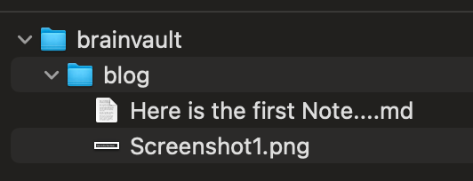
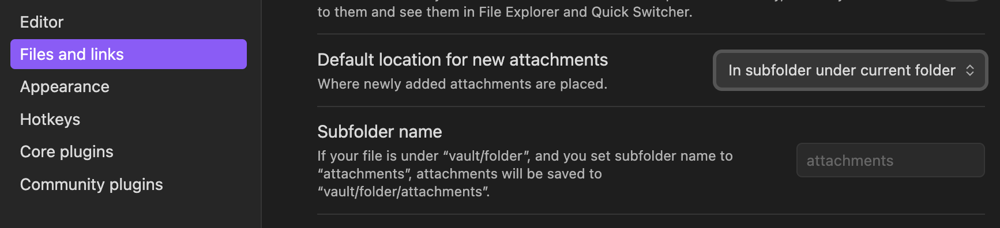
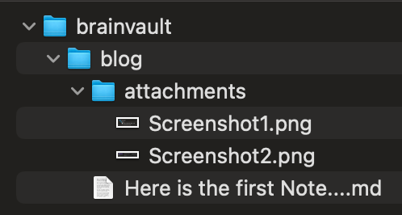
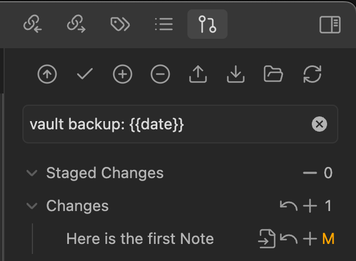

## Änderungen in den Obsidian Settings damit die Attachments in einem Subfolder gespeichert werden

So sieht die Struktur aus ohne Anpassung

<!-- more -->

In den Einstellungen auf folgendes geändert
*Files and Links* -> *Default location for new attachments* -> *In subfolder under current folder*

So sieht das dann im Finder aus

<!-- more -->
## GIT

Siehe https://help.obsidian.md/getting-started/sync-your-notes-across-devices#Git

1. Git Repo auf Github oder Gitlab anlegen
2. `git init` in dem Verzeichnis des Vaults
3. `git remote add origin [URL]`
4. Commit your changes: `git add .` and `git commit -m "Your message"`.
5. Push the changes: `git push origin main`.

### Git Plugin

Siehe https://obsidian.md/plugins?id=obsidian-git#

1. Git Plugin installieren
2. Settings überprüfen
3. *Commit-and-sync*

