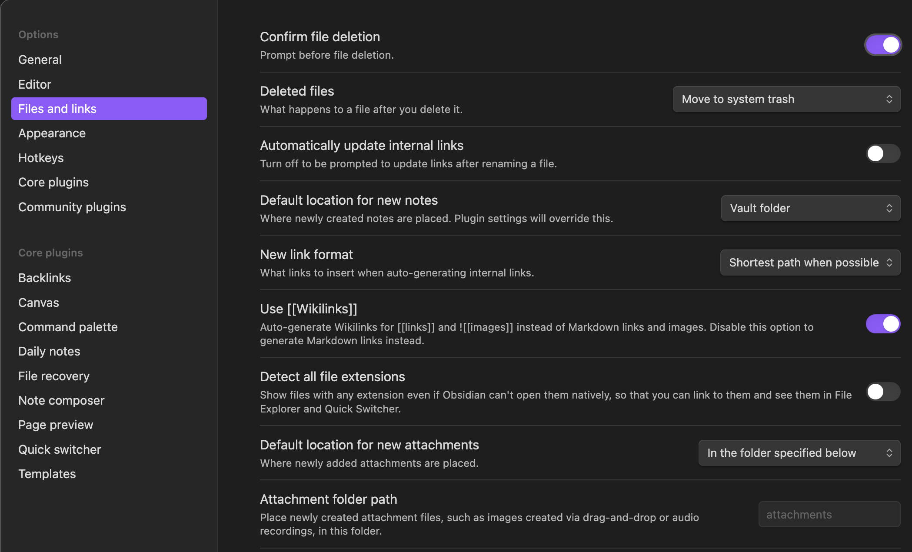
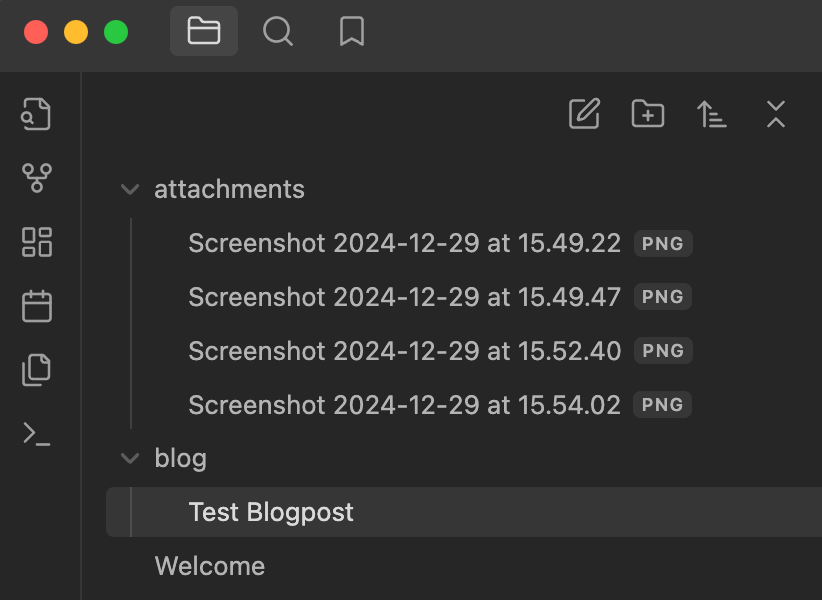

# How I've setup Obsidian for blogging

I've stumbled across this during scrolling through different youtube videos. Networkchuck showed here how he is using Obsidian for blogging -> [I started a blog... in 2024](https://www.youtube.com/watch?v=Jr5MjhgPz_c&t=380s) and here is his [Blogpost](https://blog.networkchuck.com/posts/my-insane-blog-pipeline/)

<!-- more -->

## Setup of the Obsidian Vault

1. Create a specific directory where all blogposts are located
2. Images should be located in a specific directory (see below)





## Hugo Setup

### Create a new site

1. `hugo new site testblog27122024`
2. `git init`

```sh
Congratulations! Your new Hugo site was created in /Users/harry/Developer/testblog27122024.

Just a few more steps...

1. Change the current directory to /Users/harry/Developer/testblog27122024.
2. Create or install a theme:
   - Create a new theme with the command "hugo new theme <THEMENAME>"
   - Or, install a theme from https://themes.gohugo.io/
3. Edit hugo.toml, setting the "theme" property to the theme name.
4. Create new content with the command "hugo new content <SECTIONNAME>/<FILENAME>.<FORMAT>".
5. Start the embedded web server with the command "hugo server --buildDrafts".

See documentation at https://gohugo.io/.
```

```sh
Initialized empty Git repository in /Users/harry/Developer/testblog27122024/.git/
```

### Add a theme (PaperMod)

`git submodule add --depth=1 https://github.com/adityatelange/hugo-PaperMod.git themes/PaperMod`

```sh
Cloning into '/Users/harry/Developer/testblog27122024/themes/PaperMod'...
remote: Enumerating objects: 139, done.
remote: Counting objects: 100% (139/139), done.
remote: Compressing objects: 100% (98/98), done.
remote: Total 139 (delta 36), reused 121 (delta 36), pack-reused 0 (from 0)
Receiving objects: 100% (139/139), 249.18 KiB | 19.17 MiB/s, done.
Resolving deltas: 100% (36/36), done.
```

### Create the directories under the Hugo site

1. under the subdirectory `content` -> create the new directory `posts`
2. under the subdirectory `static` -> create the new directory `images`

## Scripts for required for blogging

My Setup is different. Therefore I am showing here the scripts

### The *sync* script

* *$sourcePath* is the path to the Obsidian Vault and the subdirectory for the blog posts
* $destinationPath is the path to -> Hugo content/posts

```sh
#!/bin/bash
set -euo pipefail

# Change to the script's directory
SCRIPT_DIR="$(cd "$(dirname "${BASH_SOURCE[0]}")" && pwd)"
cd "$SCRIPT_DIR"

# Set variables for Obsidian to Hugo copy
sourcePath='/Users/harry/Developer/testvault/blog/'
destinationPath="/Users/harry/Developer/testblog27122024/content/posts/"

# Step 2: Sync posts from Obsidian to Hugo content folder using rsync
echo "Syncing posts from Obsidian..."

if [ ! -d "$sourcePath" ]; then
    echo "Source path does not exist: $sourcePath"
    exit 1
fi

if [ ! -d "$destinationPath" ]; then
    echo "Destination path does not exist: $destinationPath"
    exit 1
fi

rsync -av --delete "$sourcePath" "$destinationPath"
```

### The image *rewrite* python script

> If you are using a subdirectory on you webserver, you might need to change the line with `mark_downimage` e.g. `markdown_image = f"[Image Description](/blog/images/{image.replace(' ', '%20')})"`

```python
import os
import re
import shutil

# Paths
posts_dir = "/Users/harry/Developer/testblog27122024/content/posts"
attachments_dir = "/Users/harry/Developer/testvault/attachments"
static_images_dir = "/Users/harry/Developer/testblog27122024/static/images"

# Step 1: Process each markdown file in the posts directory
for filename in os.listdir(posts_dir):
    if filename.endswith(".md"):
        filepath = os.path.join(posts_dir, filename)

        with open(filepath, "r") as file:
            content = file.read()

        # Step 2: Find all image links in the format 
        images = re.findall(r'\[\[([^]]*\.png)\]\]', content)

        # Step 3: Replace image links and ensure URLs are correctly formatted
        for image in images:
            # Prepare the Markdown-compatible link with %20 replacing spaces
            markdown_image = f"[Image Description](/images/{image.replace(' ', '%20')})"
            content = content.replace(f"[[{image}]]", markdown_image)

            # Step 4: Copy the image to the Hugo static/images directory if it exists
            image_source = os.path.join(attachments_dir, image)
            if os.path.exists(image_source):
                shutil.copy(image_source, static_images_dir)

        # Step 5: Write the updated content back to the markdown file
        with open(filepath, "w") as file:
            file.write(content)

print("Markdown files processed and images copied successfully.")
```

## Writing a post and sync it to Hugo

1. write a new blogpost in Obsidian in the subfolder 'blog'
2. run the `sync_script.sh`
3. run the `images.py` python script
4. run `hugo` to generate the static html pages
5. sync the `public`directory to you webserver
