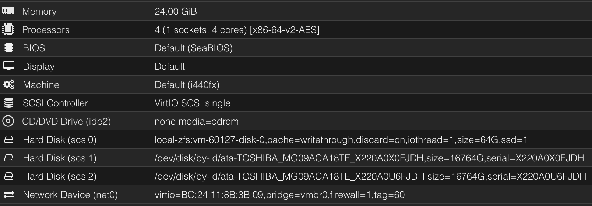

# Passthrough Physical Disk to a Proxmox Virtual Machine
For some VMs you want to have access to the physical harddrive or SSD. For example if you want to virtualise TrueNAS.

There is a good article from Proxmox [here](https://pve.proxmox.com/wiki/Passthrough_Physical_Disk_to_Virtual_Machine_(VM))

One piece is missing and that is how you add the serial number of the HDD/SSD to that device.
<!-- more -->
## Here is an example with a TrueNAS VM

1. Install the TrueNAS VM on a standard Proxmox Hard Disk (scsi0)
	- Shutdown the VM after the installation
2. On the proxmox console run `lshw -class disk -class storage` (you might need to install `lshw`)
	- Look for the HDD you want to passthrough to the VM
	- Find the serialnumber
3. Get the path/device `ls -l /dev/disk/by-id | grep <serialnumber>`
4. Add the device to the TrueNAS VM `qm set <id-of-the-truenas-vm> -scsi1 /dev/disk/by-id/ata-TOSHIBA_MG09ACA18TE_X220A0X0FJDH`
5. Repeat 2-4 for more HDDs - keep in mind to increase the number for `-scsi<number>`
6. Edit the config file of the VM and add the serials to the of the line of the HDDs devices `,serial=X220A0X0FJDH`

### Example - see `scsi1:` and `scsi2:`

```conf
agent: 1
boot: order=scsi0;ide2;net0
cores: 4
cpu: x86-64-v2-AES
ide2: none,media=cdrom
memory: 24576
meta: creation-qemu=9.2.0,ctime=1741800258
name: zulu
net0: virtio=BC:24:11:8B:3B:09,bridge=vmbr0,firewall=1,tag=60
numa: 0
onboot: 1
ostype: l26
scsi0: local-zfs:vm-60127-disk-0,cache=writethrough,discard=on,iothread=1,size=64G,ssd=1
scsi1: /dev/disk/by-id/ata-TOSHIBA_MG09ACA18TE_X220A0X0FJDH,size=16764G,serial=X220A0X0FJDH
scsi2: /dev/disk/by-id/ata-TOSHIBA_MG09ACA18TE_X220A0U6FJDH,size=16764G,serial=X220A0U6FJDH
scsihw: virtio-scsi-single
smbios1: uuid=fbc9bdfc-9df8-42e6-9cf7-6e1344b4960d
sockets: 1
vmgenid: 11eb4ddd-b7d0-4e84-b850-3bcfe1d5b311
```


