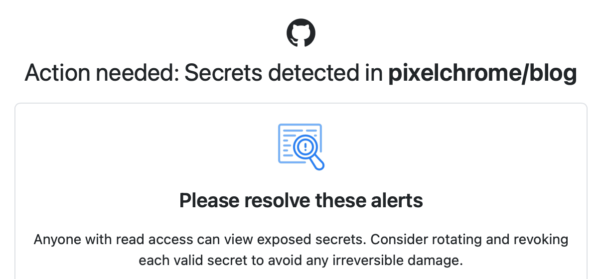

# GitHub Security Scanning

GitHub Security Scanning is a feature that helps you identify and fix security vulnerabilities in your code. It scans your code for known security vulnerabilities and provides recommendations for how to fix them. It scans also for credentials and secrets.

In one of my posts is a `Docker Swarm Join Token` (which is no longer in use), but I've just want to show how the GitHub Security Scanning works.

<!-- more -->

## GitHub Security Scanning sends you a report via email

I've received yesterday a report from GitHub Security Scanning. It found a vulnerability in my code that could be exploited by attackers.

Here is how it looks like when you open the report

I would not be necessary to fix this vulnerability, because the token is no longer in use. However, I've decided to remove it from the codebase.

